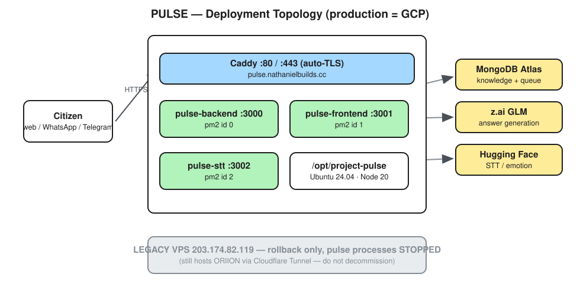
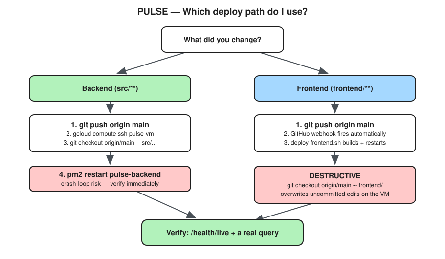

# Deploying PULSE

> **Production runs on Google Cloud.** If you are looking for the old VPS instructions, that host
> is now a **rollback target only** — see [Legacy host](#legacy-host-rollback-only) at the bottom.

<p align="center">
  
</p>

## Production at a glance

| | |
| :--- | :--- |
| **Host** | GCP Compute Engine `pulse-vm`, zone `asia-southeast1-b` |
| **Public IP** | `34.126.135.42` |
| **Domain** | `https://pulse.nathanielbuilds.cc` |
| **Repo path** | `/opt/project-pulse` |
| **OS / runtime** | Ubuntu 24.04 LTS · Node 20 |
| **Edge** | Caddy on `:80` / `:443`, automatic TLS |
| **Processes** | pm2 — `pulse-backend` :3000, `pulse-frontend` :3001, `pulse-stt` :3002 |
| **Logs** | `/var/log/pulse/{backend,frontend,stt}.{out,err}.log` |

Shell into the box with:

```bash
gcloud compute ssh pulse-vm --zone=asia-southeast1-b
```

---

## Which deploy path?

Backend and frontend deploy **differently**. Using the wrong one is the most common mistake.

<p align="center">
  
</p>

---

## Path A — backend (`src/**`)

Pushing to `main` does **not** deploy the backend. The webhook only touches `frontend/`. Backend
changes must be applied explicitly.

```bash
# 1. Land the change on main
git push origin main

# 2. Apply just the files you changed, then restart
gcloud compute ssh pulse-vm --zone=asia-southeast1-b --command='
  cd /opt/project-pulse &&
  git fetch origin main &&
  git checkout origin/main -- src/path/to/changed.ts &&
  pm2 restart pulse-backend'
```

**Check out specific files, not `git pull`.** The VM's working tree carries local modifications, and
a `pull` will either conflict or clobber them.

### Verify before you walk away

```bash
curl -s -o /dev/null -w '%{http_code}\n' https://pulse.nathanielbuilds.cc/health/live   # expect 200
gcloud compute ssh pulse-vm --zone=asia-southeast1-b --command='pm2 list | grep pulse-backend'
```

Watch the restart counter (`↺`). One increment is normal. Climbing numbers with a low uptime means
a **crash loop** — the backend has a history of these on restart, so never deploy and leave.

```bash
# tail real errors
gcloud compute ssh pulse-vm --zone=asia-southeast1-b --command='tail -50 /var/log/pulse/backend.err.log'
```

### Rollback

```bash
gcloud compute ssh pulse-vm --zone=asia-southeast1-b --command='
  cd /opt/project-pulse &&
  git checkout <last-good-sha> -- src/path/to/changed.ts &&
  pm2 restart pulse-backend'
```

---

## Path B — frontend (`frontend/**`)

Automatic. Pushing to `main` fires a GitHub webhook (`POST /webhook/github`, HMAC-verified) which
runs `deploy/deploy-frontend.sh` on the VM: fetch → checkout `frontend/` → `npm install` →
`npm run build` → `pm2 restart pulse-frontend`.

```bash
git push origin main    # that's the whole deploy
```

> [!WARNING]
> **The webhook is destructive to local frontend edits.** `deploy-frontend.sh` runs
> `git checkout origin/main -- frontend/`, which **force-overwrites the entire `frontend/`
> directory on the VM**, discarding uncommitted work there. If anyone has been editing frontend
> files directly on the VM, back them up before pushing to `main`:
> ```bash
> gcloud compute ssh pulse-vm --zone=asia-southeast1-b --command='
>   cd /opt/project-pulse && git diff HEAD -- frontend/ > /root/frontend-backup.patch'
> ```

Only `refs/heads/main` triggers it (`src/gateway/deploy.ts`). Pushing any other branch is safe.

---

## Environment

Secrets live in `/opt/project-pulse/.env` (mode `600`) and are **not** in git. See `.env.example`
for the full list. The keys that matter most:

| Variable | Purpose |
| :--- | :--- |
| `LLM_BASE_URL`, `LLM_API_KEY`, `LLM_MODEL` | z.ai GLM — answer generation |
| `MONGODB_URI`, `MONGODB_DB` | Atlas — knowledge base + officer queue |
| `HUGGINGFACE_API_KEY`, `HF_*` | STT, emotion, translation side-models |
| `WHATSAPP_*` | Meta Cloud API |
| `SESSION_SECRET`, `JWT_*` | Auth |

After editing `.env`, restart the backend (Path A verification steps still apply).

> [!NOTE]
> MongoDB Atlas enforces an **IP allowlist**. A new host — or a VM whose external IP changes —
> must be added in Atlas or every knowledge lookup fails.

---

## Troubleshooting

| Symptom | Cause / fix |
| :--- | :--- |
| `/health` returns 404 | Wrong path. The route is **`/health/live`**. |
| Backend restart count climbing | Crash loop. Read `/var/log/pulse/backend.err.log`, then roll back. |
| Frontend changes not live | Did the webhook fire? Check `backend.out.log` for `deploy-frontend`. |
| Backend changes not live | Expected — Path B does not deploy backend. Use Path A. |
| Knowledge answers empty | Atlas IP allowlist, or `MONGODB_URI` wrong. |
| Telegram bot silent | Bot is **webhook-mode**. Running a local poller deletes the prod webhook; re-set it via `setWebhook`. |

---

## Legacy host (rollback only)

`203.174.82.119` was the original VPS. Its PULSE processes are **stopped** and it is kept as a
rollback target.

> [!IMPORTANT]
> **Do not decommission it.** It still serves the separate **ORIION** project over a Cloudflare
> Tunnel. Stopping that box takes ORIION offline.

Its historical setup — Caddy config, `setup-vps.sh`, tarball/scp bootstrap — remains in `deploy/`
for reference. Do not follow it for a normal deploy.
