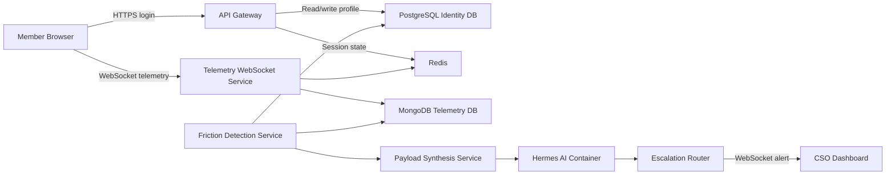
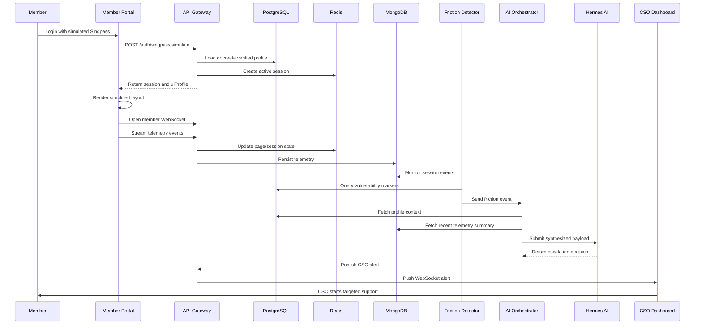

# Adaptive Service Architecture

## Full Build Documentation

This document describes how to build a modular, containerized, dual-sided Adaptive Service Architecture. The system adapts the citizen/member frontend based on a verified baseline profile, continuously detects digital friction, and escalates high-risk sessions to Customer Service Officers (CSOs) with context already attached.

The goal is not to build a generic chatbot-first support system. The goal is to build a human-aware service architecture where the interface simplifies itself when needed, digital struggle becomes visible in real time, and staff receive actionable escalation context before engaging.

---

## 1. Product Objective

The platform serves two connected audiences:

1. Members using a digital government-style portal.
2. CSOs monitoring live friction signals and intervening when needed.

The architecture solves three problems:

- Uniformity Trap: every user currently receives the same interface complexity regardless of ability, age, or support need.
- Context Blindness: CSOs usually receive escalations without knowing what the user was trying to do or where they became stuck.
- Delayed Friction Detection: struggling users are often only identified after abandonment, repeated failed attempts, or direct complaint.

The system should:

- Authenticate users through a simulated Singpass-style identity flow.
- Store stable identity and vulnerability markers in PostgreSQL.
- Stream behavioral telemetry from the frontend through WebSockets.
- Store high-velocity session friction data in MongoDB.
- Use Redis for low-latency session and socket state.
- Detect friction through a backend monitoring service.
- Synthesize a structured payload for a local Hermes AI service.
- Route severe or high-confidence cases directly to the CSO dashboard.
- Present CSOs with the specific roadblock before they engage.

---

## 2. Guiding Architecture Principles

Build the system around these principles:

- Modular services: every major concern should be independently replaceable.
- Clear data ownership: identity data and behavioral telemetry must remain separate.
- Event-driven flow: telemetry should move through explicit events rather than hidden coupling.
- Human-in-the-loop escalation: AI recommends, summarizes, and routes; CSOs resolve.
- Privacy by design: store only the data needed to detect friction and support assistance.
- Local-first simulation: the open-source stack should replicate enterprise Azure patterns without requiring Azure from day one.
- Replaceable enterprise equivalents: every local container should map cleanly to a cloud service later.

---

## 3. Recommended Build Order

Although the original question asks whether to begin with the frontend WebSocket telemetry script or the Hermes AI payload synthesis, the correct starting point is earlier.

Start with the contracts and infrastructure first.

The recommended order is:

1. Define event schemas and data contracts.
2. Build Docker Compose infrastructure.
3. Implement authentication and user profile storage.
4. Implement session creation and Redis state.
5. Implement frontend adaptive layout selection.
6. Implement frontend telemetry streaming.
7. Implement telemetry ingestion and MongoDB persistence.
8. Implement friction detection thresholds.
9. Implement Hermes AI payload synthesis.
10. Implement CSO alert routing and dashboard.
11. Add observability, tests, and security hardening.

This order prevents frontend and AI services from drifting into incompatible shapes.

---

## 4. Local Stack Overview

| Layer | Local Open-Source Component | Enterprise Equivalent | Purpose |
|---|---|---|---|
| Frontend | React or Vue | Azure Static Web Apps / App Service | Member portal and CSO dashboard |
| API Gateway | Node.js / Express / Fastify | Azure API Management | Routes REST and WebSocket traffic |
| Identity Store | PostgreSQL | Azure SQL Database | Stable verified profile data |
| Telemetry Store | MongoDB | Azure Cosmos DB | High-volume behavioral events |
| Session State | Redis | Azure Cache for Redis | Socket/session presence and short-lived state |
| AI Engine | Hermes AI container | Azure OpenAI | Friction interpretation and escalation summary |
| Realtime Transport | WebSockets | Azure Web PubSub / SignalR | Member telemetry and CSO alerts |
| Orchestration | Docker Compose | Azure Container Apps / AKS | Local service composition |

The frontend technology is intentionally replaceable. React, Vue, Next.js, a native mobile app, or a future CPF-owned interface should all be treated as clients of the same service contracts. The durable product is the backend service chain, event model, AI orchestration, telemetry contract, and CSO operating model.

Frontend clients must depend on:

- REST API contracts
- WebSocket event contracts
- stable page keys
- backend-issued UI profiles
- shared design tokens where available
- telemetry SDK behavior

Frontend clients must not own:

- vulnerability inference
- escalation rules
- Hermes routing policy
- identity truth
- CSO alert state
- telemetry schema definitions

---

## 5. High-Level System Diagram



---

## 6. Repository Structure

Use a monorepo so contracts, shared types, and local orchestration remain easy to manage.

```text
adaptive-service-architecture/
  docker-compose.yml
  .env.example
  README.md

  apps/
    member-portal/
      src/
        api/
        components/
        layouts/
        telemetry/
        adaptive-ui/
        pages/
    cso-dashboard/
      src/
        api/
        alerts/
        components/
        pages/

  services/
    api-gateway/
      src/
        auth/
        profiles/
        sessions/
        websocket/
    telemetry-service/
      src/
        ingest/
        validators/
        persistence/
    friction-detector/
      src/
        rules/
        detectors/
        jobs/
    ai-orchestrator/
      src/
        synthesis/
        hermes-client/
        routing/

  packages/
    contracts/
      src/
        identity.ts
        telemetry.ts
        escalation.ts
        ai-payload.ts
    config/
      src/
        env.ts
        logger.ts

  database/
    postgres/
      migrations/
      seed/
    mongo/
      indexes/

  docs/
    architecture.md
    api-contracts.md
    data-privacy.md
    runbook.md
```

---

## 7. Phase 1: Infrastructure and Data Segregation

### 7.1 Purpose

This phase creates the secure local foundation. The most important decision is to keep immutable identity data separate from live behavioral telemetry.

PostgreSQL stores verified user baseline data. MongoDB stores volatile session behavior. Redis stores temporary state.

### 7.2 Docker Compose Services

Define these containers:

- postgres
- mongo
- redis
- api-gateway
- telemetry-service
- friction-detector
- ai-orchestrator
- hermes-ai
- member-portal
- cso-dashboard

### 7.3 PostgreSQL Schema

PostgreSQL should store stable identity information and derived vulnerability markers.

Core tables:

```sql
users
  id uuid primary key
  singpass_subject varchar unique not null
  full_name varchar not null
  date_of_birth date not null
  age_bracket varchar not null
  created_at timestamptz not null
  updated_at timestamptz not null

user_vulnerability_markers
  id uuid primary key
  user_id uuid references users(id)
  marker_type varchar not null
  marker_value varchar not null
  source varchar not null
  confidence numeric not null
  created_at timestamptz not null

auth_events
  id uuid primary key
  user_id uuid references users(id)
  provider varchar not null
  login_at timestamptz not null
  ip_hash varchar
  user_agent_hash varchar
```

Example marker types:

- senior_age_bracket
- assisted_living_service
- caregiver_linked
- repeated_prior_support
- accessibility_preference

Do not store unnecessary medical, financial, or sensitive free-text notes unless there is a clear governance model for it.

### 7.4 MongoDB Collections

MongoDB should store high-volume telemetry and friction events.

Collections:

```text
session_events
friction_events
page_presence
escalation_audit
```

Example `session_events` document:

```json
{
  "eventId": "evt_01",
  "sessionId": "sess_01",
  "userId": "usr_01",
  "eventType": "idle_tick",
  "pageKey": "retirement_payout_planner",
  "timestamp": "2026-05-29T10:15:00.000Z",
  "metadata": {
    "idleMs": 60000,
    "viewportWidth": 1366,
    "viewportHeight": 768
  }
}
```

Recommended indexes:

```javascript
db.session_events.createIndex({ sessionId: 1, timestamp: -1 });
db.session_events.createIndex({ userId: 1, timestamp: -1 });
db.session_events.createIndex({ eventType: 1, timestamp: -1 });
db.friction_events.createIndex({ severity: 1, createdAt: -1 });
db.page_presence.createIndex({ sessionId: 1, pageKey: 1 });
```

### 7.5 Redis Usage

Redis should hold only temporary state:

- active session IDs
- user-to-socket mappings
- CSO socket subscriptions
- current page presence
- short-lived rate-limit counters
- escalation deduplication keys

Example keys:

```text
session:{sessionId}:user
session:{sessionId}:current_page
socket:{socketId}:session
cso:{csoId}:socket
escalation:dedupe:{sessionId}:{pageKey}
```

Use TTLs aggressively so stale session data expires automatically.

---

## 8. Phase 2: Authentication and Baseline Recognition

### 8.1 Simulated Singpass Flow

For local development, implement a simulated Singpass provider.

Endpoints:

```text
POST /auth/singpass/simulate
POST /auth/logout
GET  /me
```

Example login request:

```json
{
  "singpassSubject": "S1234567A"
}
```

Example login response:

```json
{
  "user": {
    "id": "usr_01",
    "displayName": "Tan Mei Ling",
    "ageBracket": "65_plus",
    "vulnerabilityMarkers": [
      {
        "type": "senior_age_bracket",
        "value": "65_plus",
        "confidence": 1
      }
    ]
  },
  "session": {
    "id": "sess_01",
    "expiresAt": "2026-05-29T12:00:00.000Z"
  },
  "uiProfile": {
    "mode": "simplified",
    "recommendedActions": [
      "check_medisave_balance",
      "view_retirement_payout",
      "request_assistance"
    ]
  }
}
```

### 8.2 UI Profile Resolution

The backend should return an explicit UI profile rather than expecting the frontend to infer vulnerability.

Recommended modes:

- standard
- simplified
- assisted
- high_contrast

Example resolver logic:

```text
If user has senior_age_bracket and no explicit preference:
  return simplified mode

If user has accessibility_preference:
  return high_contrast or assisted mode

If no markers apply:
  return standard mode
```

This keeps the frontend deterministic and auditable.

---

## 9. Phase 3: Frontend Adaptive UI

### 9.1 Purpose

The member portal should adapt after login based on the backend-issued `uiProfile`.

The frontend must not treat adaptation as cosmetic. It should reduce decision load, simplify navigation, and foreground likely tasks.

The member portal should also be built as a replaceable client. The first implementation can be React or Next.js, but the system should assume that CPF may later replace the frontend with another framework, a native app, a kiosk interface, or an official portal integration. The backend should not care which client renders the interface as long as the client honors the same contracts.

### 9.2 Frontend Replaceability Rules

Keep the frontend modular through hard boundaries:

- All user/session/profile data comes from API responses, not local assumptions.
- Adaptive layout is driven by `uiProfile`, `recommendedActions`, and page/task metadata from the backend.
- All telemetry is emitted through a small client SDK interface.
- Page identity uses stable `pageKey` values, not route paths or component names.
- Voice, chat, and assistance actions call orchestration endpoints, not Hermes directly.
- The frontend can cache display metadata, but backend policy remains authoritative.
- Shared contracts should be versioned so old and new frontends can coexist during migration.

Recommended client adapter shape:

```typescript
interface PulseClientAdapter {
  getCurrentUser(): Promise<UserProfile>;
  getUiProfile(): Promise<UiProfile>;
  startSession(): Promise<MemberSession>;
  sendTelemetry(event: TelemetryEvent): void;
  openMemberSocket(sessionId: string): RealtimeConnection;
  requestAssistance(input: AssistanceRequest): Promise<AssistanceResponse>;
}
```

Every frontend implementation should provide this adapter. Components should call the adapter rather than hard-coding fetch URLs or WebSocket behavior throughout the UI.

### 9.3 Layout Modes

Standard layout:

- full navigation
- complete feature menu
- normal density
- default typography

Simplified layout:

- 2 to 3 recommended primary actions
- larger touch targets
- plain-language labels
- high contrast
- reduced menu depth
- persistent assistance button

Assisted layout:

- simplified layout plus active support affordances
- clearer progress states
- optional CSO callback prompt
- reduced form complexity

### 9.4 Adaptive UI Components

Recommended component boundaries:

```text
AdaptiveShell
  StandardNavigation
  SimplifiedActionPanel
  AssistanceDock
  PageContent

RecommendedActionButton
  icon
  label
  description
  actionKey

AssistanceButton
  sessionId
  pageKey
```

The frontend should use the `uiProfile.mode` value to select the layout.

### 9.5 Member Portal Page Keys

Every important page must have a stable page key for telemetry and CSO context.

Examples:

```text
home
check_medisave_balance
retirement_payout_planner
update_contact_details
nomination_status
transaction_review
```

Do not rely on raw URLs alone. URLs change; page keys should be treated as product-level identifiers.

### 9.6 Design Token Layer

To make replacement easier, put reusable visual decisions in a small design-token layer rather than scattering them through page components.

Recommended tokens:

```text
color.text.primary
color.text.muted
color.surface.default
color.surface.raised
color.intent.info
color.intent.warning
color.intent.danger
color.intent.success
font.size.body
font.size.control
font.size.heading
space.1
space.2
space.3
radius.control
radius.panel
```

These tokens should be framework-neutral. A future frontend can reimplement them in CSS variables, native app styles, or CPF's official design system without changing backend behavior.

---

## 10. Phase 4: Frontend Telemetry Streaming

### 10.1 Purpose

Telemetry streaming detects signs of friction while the user is still in the session.

Capture signals that indicate difficulty, not surveillance for its own sake.

Recommended telemetry events:

- page_view
- heartbeat
- idle_tick
- click_attempt
- repeated_click
- rage_click
- backtrack
- form_error
- assistance_hover
- assistance_click
- navigation_abandon

### 10.2 WebSocket Connection

The member portal opens a WebSocket connection after authentication.

Connection URL:

```text
wss://localhost/ws/member?sessionId=sess_01
```

For local development:

```text
ws://localhost:8080/ws/member?sessionId=sess_01
```

### 10.3 Telemetry Event Contract

All frontend telemetry events should follow one shared contract.

```json
{
  "eventId": "evt_01",
  "schemaVersion": "1.0",
  "sessionId": "sess_01",
  "userId": "usr_01",
  "pageKey": "retirement_payout_planner",
  "eventType": "idle_tick",
  "timestamp": "2026-05-29T10:15:00.000Z",
  "metadata": {
    "idleMs": 60000,
    "route": "/retirement/payout-planner"
  }
}
```

### 10.4 Frontend Telemetry Module

The telemetry script should be isolated from UI components.

Suggested module:

```text
apps/member-portal/src/telemetry/
  telemetryClient.ts
  eventBuilders.ts
  idleTracker.ts
  clickTracker.ts
  heartbeat.ts
```

Responsibilities:

- maintain WebSocket connection
- queue events while reconnecting
- send heartbeat events
- detect idle duration
- normalize click metadata
- avoid collecting unnecessary personal data

### 10.5 Privacy Rules for Telemetry

Do collect:

- page key
- event type
- timestamps
- idle duration
- failed form field key, if needed
- anonymized viewport information

Do not collect:

- typed personal text
- full form values
- raw NRIC or identity numbers
- medical details
- financial account values
- exact mouse trails unless strictly justified

Click coordinates should be relative to the viewport or target element, not used as behavioral fingerprinting.

---

## 11. Phase 5: Telemetry Ingestion Service

### 11.1 Purpose

The telemetry service receives WebSocket events, validates them, stores them in MongoDB, and updates Redis session state.

### 11.2 Responsibilities

- authenticate socket connection
- validate event schema
- reject malformed events
- rate-limit noisy sessions
- persist valid events to MongoDB
- update current page in Redis
- publish normalized events for friction detection

### 11.3 WebSocket Message Types

```json
{
  "type": "telemetry.event",
  "payload": {}
}
```

```json
{
  "type": "session.page_changed",
  "payload": {
    "pageKey": "retirement_payout_planner"
  }
}
```

```json
{
  "type": "session.heartbeat",
  "payload": {
    "pageKey": "retirement_payout_planner"
  }
}
```

### 11.4 Ingestion Validation

Validation should happen before persistence.

Required fields:

- eventId
- schemaVersion
- sessionId
- userId
- pageKey
- eventType
- timestamp

Reject events where:

- session ID is not active in Redis
- user ID does not match the session owner
- page key is unknown
- event type is unknown
- payload exceeds the maximum size

---

## 12. Phase 6: Friction Detection Service

### 12.1 Purpose

The friction detector turns raw telemetry into meaningful support signals.

It should not call Hermes AI for every event. It should only call AI after deterministic thresholds suggest the session may need assistance.

### 12.2 Initial Deterministic Rules

Start simple before adding complexity.

Rule examples:

```text
Idle Vulnerable User Rule:
  If user has vulnerability marker
  And current page is transactional or benefit-related
  And idle duration >= 45 seconds
  Then create medium severity friction event

Repeated Failed Click Rule:
  If user clicks non-interactive area >= 3 times within 20 seconds
  Then create medium severity friction event

Form Error Loop Rule:
  If same form field produces >= 3 validation errors within 90 seconds
  Then create high severity friction event

Backtrack Confusion Rule:
  If user navigates between the same two pages >= 3 times within 2 minutes
  Then create medium severity friction event
```

### 12.3 Friction Event Contract

```json
{
  "frictionEventId": "fric_01",
  "sessionId": "sess_01",
  "userId": "usr_01",
  "pageKey": "retirement_payout_planner",
  "ruleId": "idle_vulnerable_user_45s",
  "severity": "medium",
  "confidence": 0.82,
  "observedSignals": [
    {
      "eventType": "idle_tick",
      "value": 60000,
      "unit": "ms"
    }
  ],
  "createdAt": "2026-05-29T10:16:00.000Z"
}
```

### 12.4 Escalation Deduplication

Use Redis to avoid repeatedly alerting CSOs for the same page and session.

Example dedupe key:

```text
escalation:dedupe:sess_01:retirement_payout_planner
```

Recommended TTL:

```text
10 minutes
```

---

## 13. Phase 7: Hermes AI Payload Synthesis

### 13.1 Purpose

Payload synthesis combines stable identity context from PostgreSQL with live friction context from MongoDB.

Hermes AI should receive a carefully shaped payload. It should not receive raw database dumps.

### 13.2 When to Invoke Hermes AI

Invoke Hermes AI only when:

- a friction event reaches a severity threshold
- the user has vulnerability markers
- deterministic rules indicate repeated struggle
- escalation dedupe does not suppress the event
- the user has not opted out of assisted intervention

### 13.3 AI Payload Contract

```json
{
  "requestId": "ai_req_01",
  "schemaVersion": "1.0",
  "generatedAt": "2026-05-29T10:16:05.000Z",
  "userContext": {
    "userId": "usr_01",
    "ageBracket": "65_plus",
    "vulnerabilityMarkers": [
      {
        "type": "senior_age_bracket",
        "value": "65_plus",
        "confidence": 1
      }
    ],
    "uiMode": "simplified"
  },
  "sessionContext": {
    "sessionId": "sess_01",
    "currentPageKey": "retirement_payout_planner",
    "currentTask": "View estimated monthly retirement payout",
    "sessionStartedAt": "2026-05-29T10:00:00.000Z"
  },
  "frictionContext": {
    "frictionEventId": "fric_01",
    "severity": "medium",
    "ruleId": "idle_vulnerable_user_45s",
    "signals": [
      {
        "type": "idle_duration",
        "value": 60000,
        "unit": "ms"
      }
    ],
    "recentEventsSummary": [
      "User opened Retirement Payout Planner.",
      "User remained idle for 60 seconds.",
      "No successful primary action was completed."
    ]
  },
  "routingPolicy": {
    "allowChatbot": false,
    "allowHumanEscalation": true,
    "preferredIntervention": "cso_live_assist"
  }
}
```

### 13.4 Hermes AI Expected Response

```json
{
  "decisionId": "decision_01",
  "recommendedAction": "escalate_to_cso",
  "priority": "high",
  "chatbotBypass": true,
  "summaryForOfficer": "User may be stuck on the Retirement Payout Planner after 60 seconds of inactivity. They are using the simplified interface and may need guided assistance to view estimated monthly payout.",
  "suggestedOpening": "Hello, I can see you may be trying to view your retirement payout estimate. Would you like me to guide you through that step?",
  "riskFlags": [
    "vulnerable_user_marker",
    "transactional_page_idle"
  ]
}
```

### 13.5 AI Guardrails

Hermes AI must not:

- make eligibility decisions
- invent personal facts
- expose sensitive markers unnecessarily
- override explicit user preferences
- initiate escalation without policy permission

Hermes AI may:

- summarize friction
- recommend escalation
- draft CSO opening language
- classify urgency
- bypass chatbot when the situation requires human help

---

## 14. Phase 8: CSO Triage Dashboard

### 14.1 Purpose

The CSO dashboard makes user friction visible to staff in real time.

The dashboard should show:

- who needs help
- where they are stuck
- why the system thinks they are stuck
- what the user was trying to do
- what intervention is recommended

The dashboard is not a generic admin panel. It is an operational console for fast, calm triage. A CSO should understand the member's situation in under 10 seconds without reading raw telemetry.

### 14.2 Dashboard Information Architecture

Use a three-panel operational layout on desktop:

```text
TopStatusBar
  LiveSystemHealth
  OpenAlertCount
  HighPriorityCount
  CurrentCSOStatus

LeftPanel
  LiveAlertQueue
  AlertFilters
  PriorityTabs

CenterPanel
  ActiveAlertDetail
  RoadblockTimeline
  MemberJourneyMap

RightPanel
  InterventionPanel
  HermesRecommendation
  NotesAndOutcome
```

Recommended desktop proportions:

- Top bar: 56px fixed height.
- Left panel: 320px to 380px width.
- Center panel: flexible, minimum 560px.
- Right panel: 360px to 420px width.

On tablet or narrow screens, collapse the right panel behind an "Actions" tab and keep the alert queue as a slide-over. CSO work should still be possible without horizontal scrolling.

### 14.3 Dashboard Modules

```text
LiveAlertQueue
  AlertList
  PriorityBadge
  SessionAge
  AssignmentState
  ChannelIcon
  LanguageChip

AlertDetailPanel
  UserContextSummary
  CurrentRoadblock
  RecentSignals
  JourneyTimeline
  CurrentPagePreview
  SuggestedOpening
  InterventionActions

CSOActionPanel
  StartVoiceCall
  StartLiveChat
  SendSimplifiedText
  OfferCallback
  TransferToSpecialist
  MarkResolved
  DismissWithReason

SecurityPanel
  ActiveRiskFlags
  SessionTrustSignals
  ScamWarningStatus
  RestrictedActionWarnings
```

### 14.4 Visual Design and Interaction Nuance

The visual language should be quiet, dense, and reassuring. This is a staff tool, so avoid marketing-style hero sections or decorative cards. Use full-width work surfaces, clear dividers, consistent row heights, and high-contrast status indicators.

Design specifics:

- Palette: neutral white or near-white surfaces, dark charcoal text, restrained blue for selected state, amber for medium priority, red only for genuine high-risk escalation, green only for resolved or healthy state.
- Typography: 14px base for dense operational text, 16px for important summaries, 20px to 24px for page headings. Avoid viewport-based font scaling.
- Alert rows: fixed 72px height with member alias, page/task, priority, waiting time, channel, and language/dialect chip.
- Priority: use both color and text label. Never rely on color alone.
- Roadblock summary: show as a plain sentence at the top of the active alert, not hidden in a log.
- Timeline: show the last 5 to 8 meaningful events only. Collapse heartbeats and repetitive idle ticks into one summarized item.
- Action buttons: primary action is "Start assist"; secondary actions are "Send message", "Offer callback", "Dismiss", and "Resolve". Dangerous or sensitive actions require confirmation.
- Empty state: show "No live alerts" with system health and last event received, so CSOs can tell the dashboard is alive.
- Loading state: use row skeletons in the alert queue and reserve panel dimensions to avoid layout shift.
- Accessibility: WCAG 2.2 AA contrast, keyboard navigable queue, visible focus rings, no hover-only controls, and readable timestamps.
- Trust nuance: sensitive vulnerability markers should be shown as support context, not labels. For example, "May need simplified guidance" is better than exposing raw internal markers in the main panel.

### 14.5 Required Dashboard Features

The first production-grade dashboard should include:

- Live alert queue with priority, age, assignment, page key, channel, and language/dialect.
- Alert detail page with Hermes summary, deterministic rule reason, and recent telemetry summary.
- Member journey timeline showing page view, idle period, repeated clicks, form errors, assistance clicks, voice/chat events, and escalation creation.
- Intervention panel for live chat, voice callback, simplified text message, specialist transfer, and resolution.
- CSO assignment states: unassigned, assigned to me, assigned to another CSO, resolved, dismissed.
- Queue filters: priority, channel, language/dialect, page/task, alert age, and assigned/unassigned.
- SLA indicators: time since alert, time since first friction event, and recommended response window.
- Dismissal reasons: false positive, user recovered, duplicate alert, test session, no action needed.
- Outcome capture: helped user complete task, sent follow-up, transferred, unable to contact, user declined help.
- Privacy guardrails: redact raw identifiers by default, reveal only with role permission and audit log.
- Staff audit trail: every view, assignment, intervention, dismissal, and resolution must be recorded.

### 14.6 Dashboard Data Model

The dashboard should read from a CSO alert projection rather than querying raw telemetry on every render.

Recommended projection fields:

```typescript
interface CSOAlertProjection {
  alertId: string;
  sessionId: string;
  userId: string;
  memberAlias: string;
  priority: "low" | "medium" | "high" | "critical";
  status: "open" | "assigned" | "in_progress" | "resolved" | "dismissed";
  assignedCsoId?: string;
  channel: "web" | "chat" | "voice" | "sms";
  language: "en" | "zh" | "ms" | "ta";
  dialect?: string;
  pageKey: string;
  currentTask: string;
  roadblock: string;
  deterministicReason: string;
  hermesSummary: string;
  suggestedOpening: string;
  riskFlags: string[];
  recentSignals: Array<{
    type: string;
    label: string;
    occurredAt: string;
  }>;
  createdAt: string;
  acknowledgedAt?: string;
  resolvedAt?: string;
}
```

### 14.7 CSO Alert Contract

```json
{
  "alertId": "alert_01",
  "sessionId": "sess_01",
  "userId": "usr_01",
  "priority": "high",
  "pageKey": "retirement_payout_planner",
  "roadblock": "User idle for 60 seconds on Retirement Payout Planner",
  "summaryForOfficer": "User may need guided assistance to view estimated monthly payout.",
  "suggestedOpening": "Hello, I can see you may be trying to view your retirement payout estimate. Would you like me to guide you through that step?",
  "createdAt": "2026-05-29T10:16:10.000Z",
  "status": "open"
}
```

### 14.8 CSO WebSocket Channel

CSOs connect to a separate WebSocket namespace.

Local URL:

```text
ws://localhost:8080/ws/cso
```

Message type:

```json
{
  "type": "cso.alert.created",
  "payload": {
    "alertId": "alert_01"
  }
}
```

Additional event types:

```text
cso.alert.created
cso.alert.updated
cso.alert.assigned
cso.alert.resolved
cso.queue.snapshot
cso.system.health
```

The dashboard should request a queue snapshot on connection, then apply WebSocket deltas. This prevents missed alerts during reconnects.

---

## 15. End-to-End Live Flow



---

## 16. API Surface

### 16.1 Authentication

```text
POST /auth/singpass/simulate
POST /auth/logout
GET  /me
```

### 16.2 Session

```text
POST /sessions
GET  /sessions/:sessionId
PATCH /sessions/:sessionId/current-page
POST /sessions/:sessionId/end
```

### 16.3 Telemetry

```text
WS /ws/member
POST /telemetry/events
GET /telemetry/sessions/:sessionId/recent
```

The REST telemetry endpoint is optional but useful for tests and fallback behavior.

### 16.4 Friction

```text
GET  /friction/events
GET  /friction/events/:frictionEventId
POST /friction/events/:frictionEventId/escalate
```

### 16.5 CSO

```text
WS   /ws/cso
GET  /cso/alerts
GET  /cso/alerts/:alertId
PATCH /cso/alerts/:alertId/status
POST /cso/alerts/:alertId/interventions
```

---

## 17. Service Responsibilities

### 17.1 API Gateway

Owns:

- HTTP routing
- WebSocket namespaces
- authentication checks
- session lifecycle
- CSO alert publishing

Does not own:

- friction detection logic
- AI payload synthesis
- telemetry analytics

### 17.2 Telemetry Service

Owns:

- telemetry validation
- telemetry persistence
- current page updates
- event normalization

Does not own:

- vulnerability interpretation
- CSO escalation decisions

### 17.3 Friction Detector

Owns:

- deterministic friction rules
- threshold breaches
- friction event creation
- escalation candidate identification

Does not own:

- final AI decision text
- CSO dashboard rendering

### 17.4 AI Orchestrator

Owns:

- payload synthesis
- Hermes AI request/response handling
- AI guardrails
- routing decision normalization

Does not own:

- raw telemetry collection
- direct frontend adaptation

### 17.5 CSO Dashboard

Owns:

- alert queue display
- alert details
- intervention controls
- resolution state updates

Does not own:

- AI decisions
- detection rules
- profile storage

---

### 17.6 Hermes AI Container

Owns:

- member chatbot reasoning
- intent classification assistance
- multilingual and dialect-aware response drafting
- voice transcript interpretation
- friction summary refinement
- CSO opening suggestions
- controlled security-test planning and reporting

Does not own:

- direct database writes
- identity verification
- final policy or eligibility decisions
- raw penetration execution against external systems
- CSO assignment state

Hermes AI should be treated as a local model service behind the AI Orchestrator. Other services call the orchestrator, not Hermes directly. This keeps guardrails, logging, prompt shaping, rate limits, and fallback behavior in one place.

---

## 18. Hermes Subagent Build Plan

Hermes should expose one container endpoint, but internally the work should be split into subagents with strict responsibilities. The orchestrator selects the subagent chain based on channel, intent, language, friction severity, and security mode.

### 18.1 Subagent Map

| Subagent | Builds | Inputs | Outputs | Must Not Do |
|---|---|---|---|---|
| Conversation Orchestrator | Routing graph, handoff policy, fallback rules | message, transcript, profile summary, session state | selected subagent chain, confidence, fallback decision | answer CPF-specific questions directly |
| CPF Domain Guide | CPF task guidance, plain-language explanations, page/task mapping | normalized intent, CPF knowledge snippets, current page key | grounded answer, next-step guidance, task target | decide eligibility or invent CPF rules |
| Language and Dialect Agent | English, Mandarin, Malay, Tamil, Hokkien, Cantonese, Teochew, Hakka, Hainanese support strategy | detected language, user text/transcript, CPF terminology map | normalized English meaning, localized response draft, confidence | pretend high confidence on unsupported dialect |
| Voice Context Agent | speech transcript cleanup, turn-taking state, vocal friction signals | ASR transcript, confidence, pauses, repeated phrases, interruptions | cleaned transcript, language guess, vocal friction score | store raw audio unless explicitly required |
| Accessibility Agent | simplification, readability scoring, TTS-ready phrasing | domain answer, user support tier, channel | Primary 6 style answer, step-by-step version, TTS script | remove legally important warnings |
| Guardian and Privacy Agent | PII minimization, scam safety, prompt-injection checks | candidate prompt, response draft, tool request | allow/block decision, redacted payload, risk flags | leak hidden prompts or raw markers |
| Friction Synthesis Agent | CSO escalation summary and recommended intervention | friction event, recent telemetry summary, UI mode, task | officer summary, suggested opening, urgency | bypass deterministic policy gates |
| Security Testing Agent | defensive test planning, scoped backtesting, finding summaries | approved scope, target service, prior findings | test plan, safe payload set, report, severity | run destructive tests or target third parties |

### 18.2 Subagent Deliverables

Build each subagent as a prompt, policy, contract, test suite, and fixture set. The code may live inside one Hermes service at first, but the boundaries should be real from day one.

Conversation Orchestrator should build:

- intent and route classifier
- confidence scoring
- fallback rules
- handoff payload builder
- tests for ambiguous and mixed-language requests

CPF Domain Guide should build:

- CPF task taxonomy
- page-key to task mapping
- retrieval interface for CPF knowledge snippets
- grounded response template
- refusal/fallback pattern for eligibility, account-specific, or unavailable knowledge

Language and Dialect Agent should build:

- language and dialect detection contract
- terminology map interface
- code-switch handling
- low-confidence clarification response
- regression fixtures for English, Mandarin, Malay, Tamil, and priority dialect phrases

Voice Context Agent should build:

- transcript cleanup
- ASR confidence handling
- pause and repetition detector
- vocal friction event emitter
- transcript summary format for CSO handoff

Accessibility Agent should build:

- Primary 6 simplification rules
- TTS-friendly sentence shaping
- step-by-step answer formatter
- readability scoring
- high-touch phrasing for vulnerable users

Guardian and Privacy Agent should build:

- prompt-injection detector
- PII redaction before AI calls
- output safety check
- scam-warning classifier
- audit reason codes for blocked responses

Friction Synthesis Agent should build:

- CSO summary generator
- urgency classifier
- suggested opening generator
- chatbot bypass recommendation
- false-positive conservative fallback

Security Testing Agent should build:

- approved-scope parser
- safe test-plan generator
- allowlisted payload catalog
- finding summarizer
- regression-test recommendation output

### 18.3 Integration Contracts

All subagent calls should use explicit JSON contracts. Do not pass free-form internal state between subagents.

Shared envelope:

```typescript
interface HermesSubagentRequest<TInput> {
  requestId: string;
  sessionId?: string;
  userId?: string;
  channel: "web" | "chat" | "voice" | "security";
  locale?: string;
  dialect?: string;
  supportTier?: "self-service" | "guided" | "high-touch";
  input: TInput;
  policy: {
    allowHumanEscalation: boolean;
    allowSensitiveData: boolean;
    allowSecurityTesting: boolean;
  };
}

interface HermesSubagentResponse<TOutput> {
  requestId: string;
  subagent: string;
  confidence: number;
  output: TOutput;
  riskFlags: string[];
  nextRecommendedSubagent?: string;
}
```

The AI Orchestrator should log the envelope metadata and risk flags, but not raw sensitive text unless explicit diagnostic logging is enabled in staging.

### 18.4 Member Chatbot Flow

For text chat:

```text
User message
-> Gateway validates session
-> AI Orchestrator builds minimal context
-> Guardian and Privacy Agent screens input
-> Conversation Orchestrator detects intent and support tier
-> Language and Dialect Agent normalizes language if needed
-> CPF Domain Guide creates grounded guidance
-> Accessibility Agent simplifies response
-> Guardian and Privacy Agent screens output
-> Response returned to member
```

For high-risk pages or vulnerable users, the chatbot should not become a wall. If confidence is low, if the user repeats confusion, or if the requested task is sensitive, the response should offer live assistance and publish a friction signal.

### 18.5 Voice Guidance Flow

Voice support should be built as a pipeline, not as a separate product:

```text
Browser microphone or phone bridge
-> Speech-to-text service
-> Voice Context Agent
-> Language and Dialect Agent
-> CPF Domain Guide
-> Accessibility Agent
-> Text-to-speech service
-> Member hears guided next step
```

Minimum viable voice capabilities:

- Push-to-talk in the member portal.
- Speech-to-text with transcript confidence.
- Language detection for English, Mandarin, Malay, and Tamil.
- Dialect detection as best-effort with explicit low-confidence fallback.
- TTS playback of simplified guidance.
- Voice friction signals: long silence, repeated question, repeated failed confirmation, interruption, and "I do not understand" phrases.

Production voice capabilities:

- Phone/IVR bridge for users who prefer calling.
- Speaker turn detection.
- Consent prompt before transcription.
- Redaction of NRIC, phone, address, and account-like identifiers from AI prompts.
- CSO handoff with transcript summary, not full raw audio by default.

### 18.6 Dialect and Translation Strategy

Dialect support should be honest and confidence-based. Hermes should distinguish:

- language detected confidently
- dialect guessed with medium confidence
- unsupported or ambiguous dialect
- code-switching between English and a local language

When confidence is low, Hermes should ask a short clarification question or switch to a supported language. It should not fabricate dialect fluency. Store terminology maps for CPF concepts so translations stay consistent across agents.

Example terminology map entries:

```text
CPF Ordinary Account
MediSave
Retirement Account
payout eligibility
nomination
contribution history
```

Each entry should include:

- official English label
- plain English explanation
- Mandarin, Malay, Tamil translation
- dialect phrase if validated
- TTS-friendly pronunciation note
- "do not translate" flag where official terms must remain unchanged

### 18.7 Security Testing Agent Boundaries

Hermes can help continuously backtest the system, but the security testing agent must be controlled by policy and scope.

Allowed:

- generate defensive test cases for this application
- run tests only against approved local, staging, or owned VPS URLs
- check authentication, rate limits, WebSocket validation, prompt injection, PII leakage, and access control
- summarize findings with reproduction steps
- create regression tests after a fix

Not allowed:

- attack third-party systems
- run destructive payloads
- attempt persistence, credential theft, malware, or data exfiltration
- bypass explicit authorization boundaries
- test production with high-volume scans unless a maintenance window and rate limits are configured

Security test execution should be separated from Hermes reasoning. Hermes proposes and summarizes. A security-runner service executes an allowlisted set of tests with rate limits and logs.

Recommended security-runner jobs:

```text
auth_regression
rbac_matrix
websocket_schema_fuzz
telemetry_rate_limit
prompt_injection_suite
pii_leakage_suite
container_baseline_scan
dependency_vulnerability_scan
```

---

## 19. Shared Contracts Package

Create a shared contracts package so frontend and backend use the same schema definitions.

This package is the main protection against frontend lock-in. Treat it as the stable interface between replaceable clients and durable backend services.

Recommended files:

```text
packages/contracts/src/identity.ts
packages/contracts/src/telemetry.ts
packages/contracts/src/friction.ts
packages/contracts/src/ai-payload.ts
packages/contracts/src/escalation.ts
packages/contracts/src/client-adapter.ts
packages/contracts/src/ui-profile.ts
```

Use a runtime validation library such as Zod if using TypeScript.

Contract rules:

- Every client-facing contract must include a `schemaVersion`.
- Breaking changes must create a new version rather than mutating the old one.
- API Gateway should accept at least one previous telemetry schema version during frontend migration.
- CSO alert contracts should be more stable than dashboard component props.
- Backend services should validate contracts at the boundary and store normalized internal records.
- Frontend clients should import generated or shared types where possible, but the backend must remain correct even if a client is not TypeScript-based.

Example telemetry schema:

```typescript
export const TelemetryEventSchema = z.object({
  eventId: z.string(),
  schemaVersion: z.literal("1.0"),
  sessionId: z.string(),
  userId: z.string(),
  pageKey: z.string(),
  eventType: z.enum([
    "page_view",
    "heartbeat",
    "idle_tick",
    "click_attempt",
    "repeated_click",
    "form_error",
    "backtrack",
    "assistance_click"
  ]),
  timestamp: z.string().datetime(),
  metadata: z.record(z.unknown()).default({})
});
```

---

## 20. Security and Privacy

### 20.1 Minimum Requirements

- Use HTTPS/WSS outside local development.
- Sign session tokens.
- Store secrets in environment variables.
- Hash or tokenize sensitive identifiers.
- Separate identity and telemetry databases.
- Apply TTL policies to telemetry where legally appropriate.
- Log access to identity and escalation data.
- Avoid raw personal data in AI prompts.
- Rate-limit telemetry ingestion.
- Validate all WebSocket messages.

### 20.2 Data Minimization

Only pass the AI engine what it needs:

- age bracket, not exact date of birth
- marker category, not full sensitive background
- summarized recent telemetry, not exhaustive click logs
- current page and task, not unrelated browsing history

### 20.3 Audit Events

Audit:

- user login
- UI profile resolution
- friction event creation
- AI escalation decision
- CSO alert creation
- CSO intervention start
- alert resolution

---

## 21. Observability

Add structured logs for every service.

Recommended log fields:

```json
{
  "timestamp": "2026-05-29T10:16:00.000Z",
  "service": "friction-detector",
  "level": "info",
  "sessionId": "sess_01",
  "userId": "usr_01",
  "event": "friction_event_created",
  "ruleId": "idle_vulnerable_user_45s"
}
```

Metrics to track:

- active member sessions
- telemetry events per minute
- invalid telemetry messages
- friction events per page
- AI requests per hour
- CSO alerts created
- average time to CSO acknowledgement
- average time to resolution
- false positive dismissal rate

---

## 22. Testing Strategy

### 22.1 Unit Tests

Test:

- UI profile resolver
- telemetry event builders
- schema validators
- friction rules
- AI payload synthesis
- escalation dedupe logic

### 22.2 Integration Tests

Test:

- login creates PostgreSQL user and Redis session
- frontend receives simplified UI profile
- telemetry event persists to MongoDB
- idle threshold creates friction event
- friction event generates AI payload
- AI response creates CSO alert
- CSO dashboard receives WebSocket alert

### 22.3 End-to-End Test Scenario

Scenario:

1. Simulate login for a user aged 70.
2. Confirm simplified UI is rendered.
3. Navigate to Retirement Payout Planner.
4. Simulate 60 seconds idle.
5. Confirm telemetry event is stored.
6. Confirm friction detector creates threshold breach.
7. Confirm AI orchestrator sends synthesized payload.
8. Confirm chatbot is bypassed.
9. Confirm CSO dashboard receives alert with roadblock summary.

---

## 23. Ubuntu VPS and Subdomain Deployment

### 23.1 Target Runtime Shape

The VPS should run the full backend as Dockerized services behind a reverse proxy. The public subdomain should terminate TLS at the edge proxy, then route traffic to the frontend, API gateway, WebSocket endpoints, and Hermes-backed AI workflows.

Recommended public shape:

```text
https://cpf.yourdomain.com              -> member portal
https://cpf.yourdomain.com/cso          -> CSO dashboard
https://cpf.yourdomain.com/api          -> API gateway REST
wss://cpf.yourdomain.com/ws/member      -> member telemetry/chat socket
wss://cpf.yourdomain.com/ws/cso         -> CSO alert socket
```

Recommended internal Docker network:

```text
reverse-proxy
api-gateway
member-portal
cso-dashboard
telemetry-service
friction-detector
ai-orchestrator
hermes-ai
security-runner
postgres
mongo
redis
```

Only the reverse proxy should expose ports publicly. Databases, Redis, Hermes, and internal services should stay on the private Docker network.

### 23.2 Reverse Proxy

Use Caddy or Nginx. Caddy is simpler for automatic TLS. Nginx is more familiar for detailed rate limits and WebSocket tuning.

Required proxy behavior:

- HTTPS redirect.
- WSS upgrade support for `/ws/member` and `/ws/cso`.
- Request body limits.
- Rate limits for auth, chat, telemetry fallback, and AI endpoints.
- Security headers.
- Access logs with IP hashing where possible.

### 23.3 Environment Separation

Use separate environment files:

```text
.env.production
.env.staging
.env.security
```

Production should disable demo users, verbose AI traces, raw transcript logging, and high-volume security scans. Staging should mirror production routing but can use seeded profiles and synthetic telemetry.

### 23.4 Persistent Volumes and Backups

Persist:

- PostgreSQL data.
- MongoDB data.
- Redis only if durable queues are added later. Otherwise Redis can remain ephemeral.
- uploaded policy/knowledge files if used.
- security reports.

Back up PostgreSQL and MongoDB separately. Telemetry retention should be shorter than identity retention.

### 23.5 VPS Security Baseline

Minimum VPS hardening:

- SSH keys only, password login disabled.
- Non-root deployment user.
- Firewall allows only 22, 80, and 443 publicly.
- Docker daemon not exposed over TCP.
- Automatic OS security updates.
- Container images pinned by version.
- Secrets stored in env files with restricted permissions or a secret manager.
- Health checks for every service.
- Log rotation configured before live testing.

### 23.6 Deployment Order

Deploy in this order:

1. Reverse proxy with TLS.
2. Databases and Redis on private Docker network.
3. API gateway health endpoint.
4. Member portal and CSO dashboard shells.
5. Telemetry WebSocket path.
6. Friction detector.
7. AI orchestrator and Hermes container.
8. Security runner in disabled-by-default mode.
9. Scheduled backups and monitoring.

Do not expose Hermes directly to the internet. All Hermes traffic must pass through the AI Orchestrator.

---

## 24. Implementation Milestones

### Milestone 1: Contracts and Containers

Deliverables:

- monorepo structure
- Docker Compose file
- shared contracts package
- PostgreSQL migrations
- MongoDB indexes
- Redis connection module

Completion criteria:

- all containers boot locally
- services can connect to databases
- shared schemas compile

### Milestone 2: Authentication and UI Profile

Deliverables:

- simulated Singpass login
- PostgreSQL user profile storage
- vulnerability marker seeding
- UI profile resolver

Completion criteria:

- login returns session and UI profile
- senior test user receives simplified mode

### Milestone 3: Adaptive Member Portal

Deliverables:

- standard layout
- simplified layout
- recommended action panel
- stable page keys

Completion criteria:

- frontend changes layout based on backend `uiProfile`
- simplified mode shows 2 to 3 priority actions

### Milestone 4: Telemetry Streaming

Deliverables:

- WebSocket telemetry client
- heartbeat tracking
- idle tracking
- click attempt tracking
- telemetry ingestion service

Completion criteria:

- member portal streams telemetry events
- MongoDB stores valid events
- invalid events are rejected

### Milestone 5: Friction Detection

Deliverables:

- deterministic rule engine
- idle vulnerable user rule
- repeated click rule
- form error loop rule
- friction event persistence

Completion criteria:

- 60-second idle scenario creates a friction event
- dedupe prevents repeated alerts for the same issue

### Milestone 6: Hermes AI Orchestration

Deliverables:

- AI payload synthesis service
- Hermes AI client
- response normalizer
- escalation decision guardrails

Completion criteria:

- friction event produces structured AI payload
- AI response returns CSO-ready summary
- chatbot bypass flag is honored

### Milestone 7: CSO Dashboard

Deliverables:

- CSO WebSocket channel
- live alert queue
- alert detail panel
- suggested opening display
- intervention action controls

Completion criteria:

- CSO receives live alert
- alert includes page, roadblock, severity, and suggested opening
- CSO can mark alert resolved

### Milestone 8: Hardening and Demo

Deliverables:

- observability logs
- test suite
- seeded demo users
- scripted demo path
- privacy review notes

Completion criteria:

- end-to-end demo runs locally
- test suite passes
- documented privacy boundaries are enforced

---

## 25. Development Start Point

Begin with the foundation, not the WebSocket script or AI payload synthesis.

First code modules to draft:

1. Shared contracts package.
2. Docker Compose infrastructure.
3. PostgreSQL identity schema.
4. MongoDB telemetry schema and indexes.
5. Simulated login endpoint.
6. UI profile resolver.

After those are stable, build the frontend WebSocket telemetry script. The Hermes AI payload synthesis should come after telemetry ingestion and friction detection exist, because it depends on reliable session and friction data.

Recommended first implementation sequence:

```text
contracts -> databases -> auth -> uiProfile -> adaptive UI -> telemetry -> friction -> AI -> CSO dashboard
```

---

## 26. Definition of Done

The system is complete when:

- a vulnerable demo user receives a simplified frontend after login
- telemetry streams continuously from the member portal
- MongoDB stores session behavior without mixing it into identity data
- Redis tracks active sessions and sockets
- friction rules detect idle or repeated failed actions
- a synthesized AI payload combines profile and roadblock context
- Hermes AI recommends whether to escalate
- chatbot intervention is bypassed for high-risk cases
- CSO dashboard receives a live alert
- the alert explains the exact roadblock before the CSO engages
- the entire flow runs locally through Docker Compose

---

## 27. Summary

This architecture should be built as a modular service chain:

```text
Identity baseline -> Adaptive interface -> Telemetry stream -> Friction detection -> AI synthesis -> CSO escalation -> Human resolution
```

The most important engineering discipline is to keep each layer honest:

- PostgreSQL knows who the user is.
- MongoDB knows what is happening in the session.
- Redis knows who is currently connected.
- The frontend adapts based on explicit backend policy.
- The detector identifies friction deterministically.
- Hermes AI summarizes and routes.
- The CSO dashboard enables human intervention with context.

That separation is what makes the system modular, auditable, and ready to evolve from a local open-source prototype into an enterprise Azure deployment.
