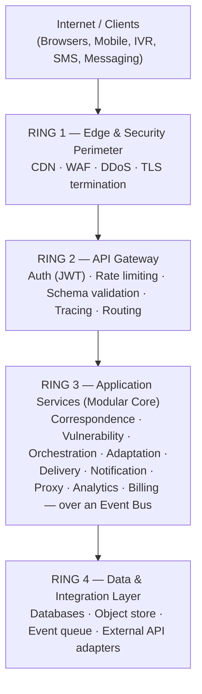
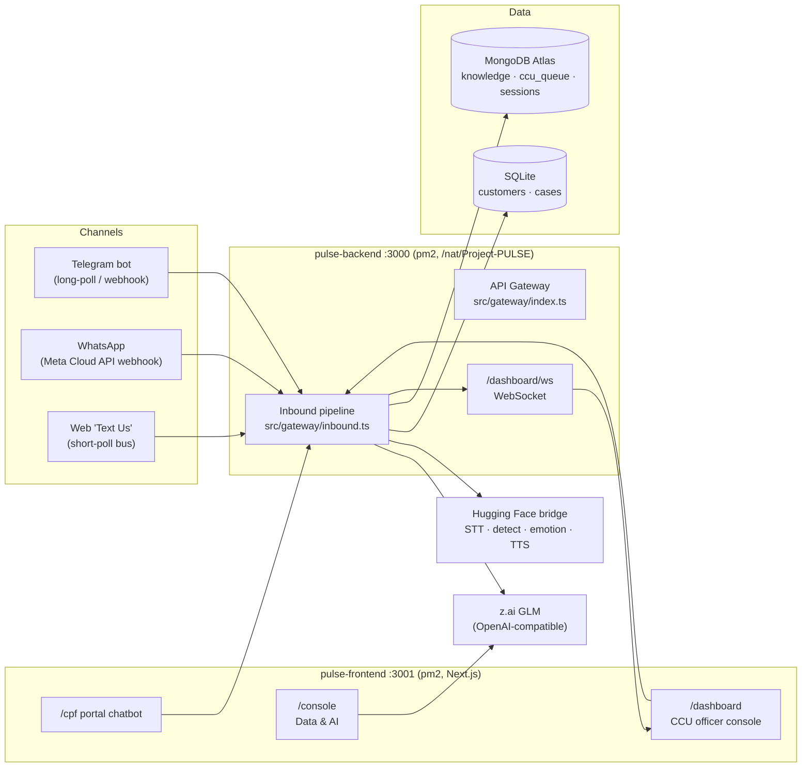
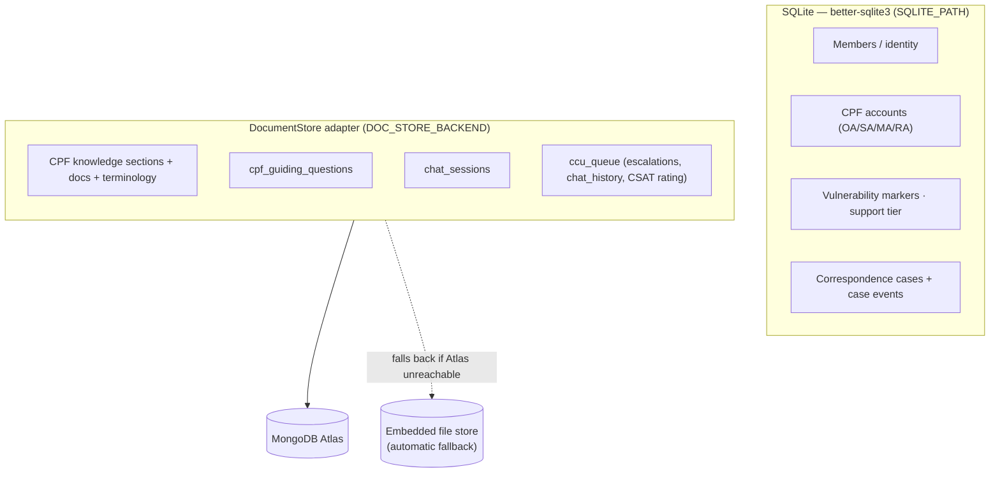
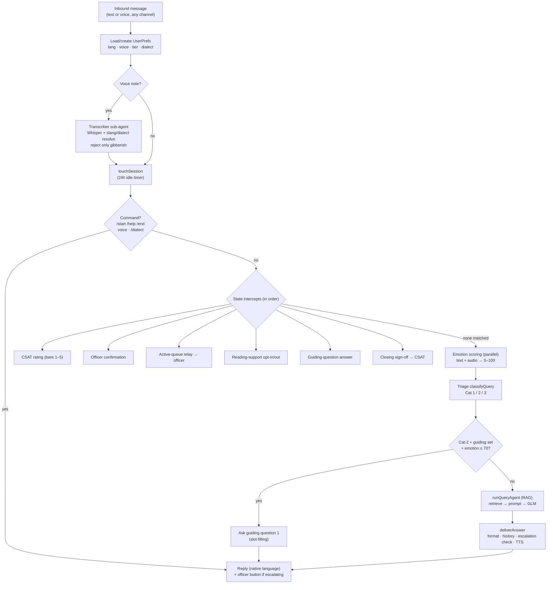
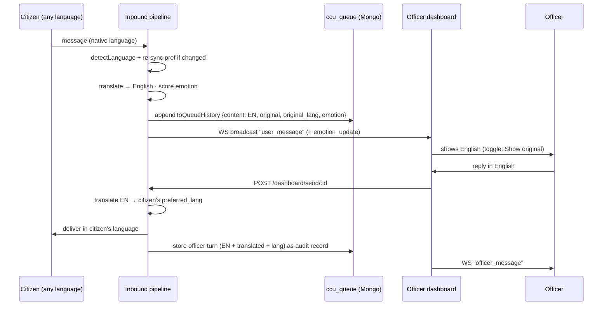

# PULSE — Prototype System & Architecture Report

> **People-centric Framework for Correspondence (PFC)** — a Singapore digital-inclusion platform.
> This report documents the **running prototype**: a live, multi-channel CPF assistant with a
> Customer Correspondence Unit (CCU) officer console, sitting on top of a broader (partly
> scaffolded) multi-service architecture.

| | |
| :--- | :--- |
| **Document** | Prototype System & Architecture Report |
| **Version** | 1.0 |
| **Date** | 2026-07-24 |
| **Repository** | `Project-PULSE` (branch `Reporting`) |
| **Status of system** | Live Telegram + WhatsApp + Web "Text Us" CPF assistant; live CCU officer dashboard; scaffolded microservice + multi-agent architecture around it |
| **Automated test status** | `npm test` → **149/149 passing**, 17 files, 0 type errors (run 2026-07-24) |

---

## 0. A note on accuracy (read this first)

This report was assembled by reading the **actual source tree and running the test suite**, not
only the design docs. Two things are flagged up-front because the request asked about them
specifically, and honesty matters more than filling a heading:

1. **There are no MCP (Model Context Protocol) servers in this prototype.** A full-tree search
   (`grep -ri mcp`) returns **zero** references in application code. PULSE does not host, expose, or
   consume any MCP server. The only "MCP" in the vicinity is the tooling inside the *Claude Code
   development environment* used to build and test the project (e.g. a Telegram and a Google-Drive
   connector) — that is build-time tooling, **not part of PULSE's architecture**. Section 10 explains
   what *does* play the role people sometimes associate with MCP here (the swappable AI-provider and
   messaging-channel adapters). If you actually meant "document the MCP tooling in my Claude Code
   environment," tell me and I'll write that up separately.

2. **"Hermes" refers to three unrelated things** in this codebase, and the design docs blur them.
   They are disambiguated in Section 10. Notably, the function literally named `callHermes()` in the
   live query pipeline **calls z.ai GLM**, not any Hermes model — the name is legacy.

Where the design documents (`README.md`, `CONTEXT.md`, `AGENT_ARCHITECTURE.md`, `AGENTS.md`)
describe capabilities that are **aspirational** (designed but not built), this report says so
explicitly. The ground truth is the code in `src/**` and `frontend/**` plus the git history, which
is newer than the prose docs in places.

Headings left deliberately **empty** mark information I could not verify from the repository and did
not want to fabricate (e.g. team roster, third-party security-audit results, production performance
benchmarks). They are yours to fill.

---

## 1. Executive Summary

PULSE is a framework for making Singapore government correspondence **adaptive, inclusive, and
accessible** to vulnerable citizens — seniors, persons with disabilities, and low-digital-literacy
individuals. The design philosophy is captured in the **PULSE** pillars: **P**eople-centric,
**U**niversal, **L**inked, **S**ecure & supportive, with an implicit **E**mpathetic thread.

The **running prototype** is a multilingual **CPF (Central Provident Fund) assistant** reachable over
three channels — a **Telegram bot**, **WhatsApp** (Meta Cloud API), and an in-browser **"Text Us"
web chat** — all feeding **one shared inbound pipeline** and **one live CCU officer dashboard**. It
answers CPF questions with retrieval-augmented generation (RAG) grounded in a MongoDB knowledge base,
formats answers to a government plain-language standard, generates replies **natively** in the user's
language, adapts its **tone** to the caller's emotion, runs an interactive **guiding-question** flow
for broad/personal questions, and **escalates** complex, private, or distressed cases to a human
officer with **two-way translated relay**. Voice in (speech-to-text) and voice out (text-to-speech)
are supported. Sessions end with a **1–5★ CSAT rating**.

Around this live slice sits a **scaffolded** enterprise architecture: a 4-ring security model, a
9-service modular core, and an aspirational multi-agent AI system ("OpenClaw"). Much of that is
design-complete but not yet implemented; this report is careful to separate the two.

---

## 2. Problem & Insights

### 2.1 The problem

Singapore's Smart Nation programme has digitised most public-service touchpoints. That benefits the
digitally fluent majority but widens an accessibility gap for citizens who cannot easily navigate
institutional correspondence — tax notices, healthcare appointments, housing letters, CPF and
benefits disbursements. When correspondence fails for these users the consequences are severe:
missed medical treatments, unpaid fines, lost benefits, and eroded trust in public institutions.

| Vulnerable group | Key challenge | Scale (as stated in project docs) |
| :--- | :--- | :--- |
| **Seniors (65+)** | Low digital literacy, fear of scams, declining vision | ~1 in 4 citizens by 2030 |
| **Persons with disabilities** | Screen-reader incompatibility, cognitive overload in complex forms | ~3.4% of resident population |
| **Low digital-literacy individuals** | Unfamiliarity with gov portals, language barriers, tech anxiety | Underserved across all ages |
| **Caregivers / proxies** | Need delegated, auditable access to help a family member | — |

> The population figures above are as asserted in the project's own documentation; they are not
> independently sourced in this report.

### 2.2 Core insights that shaped the design

- **Treat the human, not the demographic.** One-size-fits-all automation is the root cause. The
  system should detect *individual* vulnerability signals (repeated failed logins, long idle times,
  bounced notifications, declared needs, age) and adjust complexity, channel, tone, and support level
  in real time — sorting users into **self-service / guided / high-touch** tiers.
- **Dialect is comprehension, not translation.** Many seniors aged 75+ are more fluent in **Hokkien**
  or **Bazaar Melayu** than in Mandarin or formal Tamil. The 1979 Speak Mandarin Campaign shifted
  schooling to Mandarin *after* today's elderly had left school. For them, a message in dialect is the
  **primary language of comprehension** — so dialects are designed as first-class agents, not
  afterthoughts.
- **Analog trust bridges to digital.** Vulnerable users often trust physical mail and phone more than
  apps. Rather than forcing digital adoption, PULSE is designed to create a **continuum** — QR codes
  and hotlines on physical mail, voice-assist read-aloud, proxy portals — using each channel to ease
  the next.
- **Scam-resistance is a feature, not a footnote.** Vulnerable users are disproportionately targeted.
  Hence: **no clickable links** in SMS/email (users type known `gov.sg` URLs manually), verifiable
  reference codes, and scam education woven into the flow. This principle is enforced even in the live
  bot (it warns about scams and never asks for passwords/OTP).
- **Never trap a user in a bot.** A human-agent fallback is offered at every decision point. The live
  prototype implements exactly this: any complex/personal/distressed turn can hand off to a CCU
  officer, carrying full conversation context.
- **Proactive, not reactive.** Intervene *before* drop-off — e.g. unopened notification after 48h →
  simplified SMS; no action after 5 days → voice callback. (This is framework-level design; the live
  slice implements the conversational + escalation portion.)

### 2.3 The PULSE pillars

| Letter | Pillar | One-liner |
| :--- | :--- | :--- |
| **P** | People-Centric | Design for the human, not the demographic. Context-aware, adaptive communication. |
| **U** | Universal | Accessibility by default — WCAG 2.2 AA, plain language, multi-channel. |
| **L** | Linked | Seamless analog↔digital bridges: physical mail + digital + voice continuum. |
| **S** | Secure & Supportive | Empowering without exposing — scam-resistant, high-touch verification. |
| **E** | Empathetic (implicit) | Keep a finger on the "pulse" of the community. |

---

## 3. What the Prototype Actually Is (live vs. aspirational)

This is the single most important table for anyone evaluating the system, because the design docs
describe a much larger platform than what currently runs.

| Capability | Status | Where it lives |
| :--- | :--- | :--- |
| Multi-channel CPF chatbot (Telegram / WhatsApp / Web) | **Live** | `src/gateway/inbound.ts`, `telegram.ts`, `webhook.ts`, `webchat.ts` |
| RAG answers grounded in CPF knowledge base | **Live** | `src/agents/query/`, `src/data/knowledge/`, `src/data/docstore/` |
| Triage (Category 1/2/3) | **Live** | `src/agents/triage/classifier.ts` |
| Interactive guiding questions | **Live** | `src/data/knowledge/guiding.ts`, `src/agents/query/guidedSynthesis.ts` |
| Emotion scoring → tone adaptation → trajectory | **Live** | `src/agents/main/{emotion,tone,emotionTrajectory}.ts` |
| Government-standard formatting + native-language generation | **Live** | `src/agents/query/agent.ts`, `src/shared/formatter.ts` |
| CCU officer dashboard + escalation + two-way translated relay | **Live** | `frontend/src/components/CpfDashboard.jsx`, `src/gateway/dashboard.ts`, `src/dashboard/` |
| Officer compliance guard (blocks disclosing private figures) | **Live** | `frontend/src/components/CpfDashboard.jsx` |
| CSAT rating + session lifecycle | **Live** | `src/services/session/manager.ts` |
| Voice STT in / TTS out | **Live** | `src/agents/transcriber/`, `src/python-bridge/`, `src/shared/hf/` |
| Data & AI Console (browse customers/cases/knowledge, copilot) | **Live** | `frontend/src/app/console/`, `src/services/console/`, `src/services/copilot/` |
| Adaptive-local friction → CSO-alert engine | **Built (local)** | `src/services/adaptive-local/` |
| SQLite (customers/cases) + MongoDB (knowledge/queue) persistence | **Live** | `src/data/sqlite/`, `src/data/docstore/` |
| 9-service modular core (correspondence, vulnerability, …) | **Scaffolded** (routes only, mostly stubs) | `src/services/*/routes.ts` |
| OpenClaw multi-agent hierarchy (orchestrator, domain, dialect agents) | **Aspirational** — no such code exists | referenced in docs; not in `src/` |
| PostgreSQL / Redis / Kafka | **Aspirational** — deps removed 2026-06-26 | design docs only |
| Singpass / SingPost / physical-mail adapters | **Not started** | `src/adapters/` (Telegram/Meta/Twilio/Web exist) |
| CI/CD, Infrastructure-as-Code | **Not started** | — |

> **Reader's guide:** Sections 5–8 describe the **live** systems in depth. Section 4 presents the
> **aspirational** architecture (the blueprint) alongside the **live** runtime topology so the two are
> never confused.

---

## 4. System Architecture

### 4.1 The 4-Ring security model (design blueprint)

The platform is designed as a modular, event-driven SaaS in a concentric-ring security model. Each
ring inward is more protected and more specific; nothing reaches inward without passing the layer
above.



**Status:** Ring 2 (gateway, auth middleware, rate limiter, tracing) is **built**; Ring 3 exists as
**route scaffolds**; Ring 1, the event bus, and the aspirational Ring-4 infrastructure
(PostgreSQL/Redis/Kafka/S3) are **design-only**. The *live* data layer is described in §4.3.

**Key design decisions (blueprint):** event-driven services (asynchronous, add consumers without
touching producers), schema-per-service isolation, an adapter pattern wrapping every external API,
JWT in httpOnly cookies (15-min access + rotated 7-day refresh), API versioning (`/api/v1`), feature
flags, and idempotent event consumers with circuit breakers on synchronous calls.

### 4.2 Live runtime topology

What actually runs in production today:



**Deployment facts (from `DEPLOY.md` / `POST.md`):** both pm2 processes — `pulse-backend` (:3000)
and `pulse-frontend` (:3001) — run from `/nat/Project-PULSE`. A **Caddy** reverse proxy fronts them
and must forward `/webchat/*` and the `/dashboard/ws` WebSocket. The **frontend auto-deploys from
`main`** via a GitHub webhook; the **backend is deployed manually** (pm2 restart). A public URL
(`pulse.nathanielbuilds.cc`) fronts the stack. *(Deployment specifics such as TLS certificates,
scaling, and hosting provider are not fully enumerated in the repo — see the placeholder in §13.)*

### 4.3 Live data layer

Two stores, matching the "two databases" design intent (SQLite ≈ the "Azure SQL" equivalent; Mongo ≈
the "Cosmos DB" equivalent):



- **`DocumentStore`** is an adapter: `DOC_STORE_BACKEND=mongo` uses Atlas (`MONGODB_URI`), and
  **auto-falls back to an embedded file store** if the cluster is unreachable — so the stack always
  runs.
- **Seed data:** `npm run db:seed` generates ~150 representative Singaporean members (realistic ethnic
  name mix, senior-skewed ages, dialects, age-appropriate CPF balances, vulnerability markers) and
  189+ correspondence cases with timelines, plus loads the CPF knowledge. Deterministic (seeded RNG).
  `npm run db:seed:named` inserts a fixed, hand-specified member set (additive, idempotent).
- **Known drift (documented gotcha):** the committed `data/cpf-knowledge.json` uses `sectionKey`
  values like `retirement-income`/`growing-savings`/`home-ownership`, while the **live Atlas** holds a
  dataset keyed `retirement`/`topups`/`housing`. Guiding-question sets carry an `aliases` list to
  match either vocabulary. **Do not** re-seed from the dev checkout expecting the live Atlas to match —
  they have diverged, and re-seeding replaces shared Atlas knowledge.

---

## 5. The Chatbot — Live Conversational Pipeline

The chatbot is **not** a single LLM call — it is a linear pipeline in `src/gateway/inbound.ts`
(`processInbound`, the loop that was refactored 412 → 221 lines and split into `handleCommand` /
`runStateIntercepts` / `deliverAnswer`). Every inbound message — from Telegram, WhatsApp, or the web
"Text Us" channel — enters here. The description below is verified against source.

### 5.1 End-to-end message flow



**Key ordering facts (they are behaviour-bearing):** the active-queue **relay** intercept runs
*before* triage/guiding, so once a citizen is escalated their words always reach the officer, never
the bot. Emotion scoring is kicked off **in parallel** (`Promise.all`) so it adds ≈0 ms. Voice input
is rejected **only** when it looks like gibberish/hallucination (empty, <2 chars, a known stock
caption like "thanks for watching", or ≥4 identical repeated words) — Whisper's transcript is
otherwise trusted regardless of language or length. `confidence` is computed but only *logged*, it
does not gate.

### 5.2 Triage: Categories 1 / 2 / 3

`src/agents/triage/classifier.ts` is a **pure regex classifier** (English patterns, no LLM),
evaluated in precedence Cat-3 → Cat-2 → Cat-1:

| Category | Meaning | Behaviour |
| :--- | :--- | :--- |
| **Cat 3** | Personal account data / privacy boundary ("my balance", "how much do I have") | Hard privacy stop — the bot must not guess figures; directs to `cpf.gov.sg/member` login or an officer |
| **Cat 2** | Partially answerable — eligibility, advice, payout estimates needing personal data | Answer the *public* part fully + one line noting personal specifics need an officer; may trigger **guiding questions** |
| **Cat 1** | Public knowledge (default; "when in doubt, let the bot try") | Bot answers directly, no officer offer |

A **number guard** (`USER_PROVIDED_NUMBER`) downgrades a Cat-2 estimate to Cat-1 when the user
supplies their own figures (the bot can then compute fully). *Known limitation: patterns are
English-only, so a Chinese personal-balance question can default to Cat-1.*

### 5.3 Retrieval-Augmented Generation (RAG)

`runQueryAgent` (`src/agents/query/agent.ts`) is the answer engine. Verified pipeline:

1. **Retrieval is lexical, not vector.** `searchKnowledge` / `searchTerminology`
   (`src/data/knowledge/repository.ts`) tokenize the query, drop stop-words, expand aliases
   (`oa → ordinary account`, …), and score matches by weighted field overlap (**title 4 / topic 3 /
   body 2 / tags 1**). *There are no embeddings or semantic search* despite the "RAG" framing.
2. For a non-English query the text is translated to English **for retrieval only** (the knowledge
   base and glossary are English); the LLM still sees the user's original words.
3. **System prompt** = `BASE_SYSTEM_PROMPT` (PULSE persona; answer only from retrieved info;
   phone-style formatting; quote exact figures, never invent; **never emit links/URLs** — "government
   agencies never send links"; reply only in the named language) **+** the triage `promptHint` **+** a
   reading-level directive (guided ≤60 words, high-touch ≤40) **+** the emotion `toneDirective`.
4. **LLM call:** `callHermes(...)` → **z.ai GLM** (see §7.1), with GLM "thinking" tokens disabled and a
   hard **reply-language pin** ("write your ENTIRE reply in this language and no other" — GLM otherwise
   drifts to Chinese).
5. **Guards:** a language-drift check retries once if the reply is in the wrong language (and never
   caches a wrong-language reply); a grounding check flags a reply only if it introduces **>3**
   dollar/percent numbers absent from the retrieved content (word-overlap is deliberately *not* used
   because GLM paraphrases). On empty LLM output the agent returns the raw retrieved knowledge but
   marks `requiresHumanReview` so junk is never cached and an officer is offered (fix **B8**).
6. **Response cache** keyed on a SHA-256 of `intent | query | language | triage.category |
   emotion.label | sustained | tier | history` — note the **emotion tier is part of the key**, so a
   soothing reply is never served to a calm user from cache.

### 5.4 Interactive guiding questions

Broad Cat-2 questions ("how much CPF LIFE payout will I get?") depend on the user's age/plan/target,
which the bot cannot read — so it **asks**. `findGuidingSetForQuery`
(`src/data/knowledge/guiding.ts`) classifies the topic (top-1 knowledge `sectionKey`), pulls a
**curated** question set from the `cpf_guiding_questions` Mongo collection (matched by `topicKey` **or**
an `aliases` list, to survive the section-key drift noted in §4.3), and asks the questions **one at a
time** (choice → buttons, open → inline "(for example: …)"). Each answer is intercepted before the LLM
(`recordGuidingAnswer`); when all are answered, `synthesizeGuidedAnswer`
(`src/agents/query/guidedSynthesis.ts`) composes a tailored answer **natively in the user's language**.
The LLM only classifies the topic and writes the final answer — it never generates the questions (no
structured-output dependency). Guiding is **skipped when emotion > 70** so a distressed user routes to
escalation instead. Escape hatches: an explicit officer request escalates; "cancel"/"stop" exits.

### 5.5 Emotion-driven tone & trajectory

Three cooperating pieces under `src/agents/main/`:

- **`emotion.ts` — scoring.** `scoreEmotion(text, audio?)` returns 0–100. Crucially, only the
  *distress* labels `{anger, sadness, fear, disgust}` contribute the text score; joy/neutral/surprise
  map to a **0** base (this is fix **B1** — a happy "thank you!!" no longer reads as "rage"). Audio
  emotion (valence/arousal) adds a small boost. Bands: `rage >80`, `angry >65`, `frustrated >50`,
  `sad >35`, else neutral.
- **`tone.ts` — directive.** `toneDirective(score, label, sustained)` injects a per-band empathy
  directive into the query system prompt: angrier callers get warmer, less-formal, empathy-first,
  de-escalating replies — but with two invariants: **soften the tone, never the content** (the full
  answer + figures always survive a false high-emotion read) and **never name the caller's emotion**
  back to them. Tone never offers an officer (the escalation layer owns that).
- **`emotionTrajectory.ts` — folding.** `effectiveEmotion(current, recentScores)` folds the current
  turn with a recency-weighted average (decay 0.6) of recent *scored* turns, but **only ever raises**
  soothing: `effectiveScore = max(current, trendAvg)`. So a real spike soothes immediately, a caller
  who cooled stays soothed (safe direction), and a stray spike in calm history decays away. A
  `sustained` flag (≥2 of the last 3 turns above the angry band) adds an "ongoing difficulty"
  acknowledgement and also raises the case's queue priority (+10).

> **Honest limitation (stated in the code):** the emotion model
> (`j-hartmann/emotion-english-distilroberta-base`) is **English-trained**, so tone is most reliable
> for English/Singlish and systematically under-reads distress in zh/ms/ta. Trajectory smoothing
> reduces *noise*; it does not fix this bias.

### 5.6 Government-standard formatting & native-language generation

- **Concision is enforced at *generation*, not post-processing.** `BASE_SYSTEM_PROMPT` tells GLM to
  front-load the answer, stay under ~120 words (lead + 2–4 short bullets), use ≤25-word sentences,
  expand acronyms, begin with one topic emoji (💰/🏠/🏥/📅/ℹ️), and quote exact figures. Target reading
  age ≈ 9 (GOV.UK content design + Singapore SGDS).
- **Native-language generation.** The LLM replies **directly** in the user's language; the two calls
  that used to re-translate the LLM's own reply were removed (translating a native reply
  double-translates). Only fixed English UI strings and officer-relay text are translated.
- **Deterministic formatter** (`src/shared/formatter.ts`, language-agnostic):
  `stripLinks → stripMarkdown → structureText → normaliseWhitespace → capLength`, then HTML-bolds key
  terms. `stripLinks` removes any URL / `*.gov.sg` domain (agencies never send links). `capLength`
  trims to the last complete sentence at ~900 chars using **both** Latin `.!?` **and CJK `。！？`**
  terminators (preserving a trailing `cpf.gov.sg` URL); bullets are capped at 6. This backstops
  Telegram's 4096-char limit; emojis and `$`/`%` bolding survive.

### 5.7 The "thinking" animation & response caching

While the pipeline composes a reply (often ~30–90 s), the Telegram bot shows a 💭 dot hopping across
**one** bubble (~2 s/frame, plus the native "typing…" action); when the answer is ready that same
bubble is edited into the final reply — no extra bubbles (`src/gateway/thinking.ts`). The ~2 s
interval respects Telegram's ~1-edit/sec/chat limit. WhatsApp degrades to typing-only. Response
caching is described in §5.3 (emotion-tier-aware key; wrong-language replies never cached).

---

## 6. The CCU Officer Console

When the bot cannot or should not answer, a case is escalated to a human **CCU officer** who works from
a live dashboard (`frontend/src/components/CpfDashboard.jsx`, served at `/dashboard`). One dashboard
serves all three channels; each citizen is identified by a channel-prefixed id (`tg:`, `wa:`, `web:`)
and replies route back to the right channel.

### 6.1 Escalation: when and how a case is created

`analyzeEscalation` (`src/agents/escalation/analyzer.ts`) decides escalation via five keyword layers,
in priority order: **(1)** explicit request (English + i18n for zh/ms/ta/hi/ml/pa, so even a bot's
translated promise "转接给专员" carries the button), **(2)** personal data, **(3)** life event
(death/disability/divorce/bankruptcy/estate), **(4)** complaint/dispute (wrong amount, not credited),
**(5)** bot failure (confidence < 0.4 + a hedge phrase). A **>70 distress override** in
`deliverAnswer` forces escalation regardless of keywords. When escalation is offered,
`pendingOfficerOffer` is set so a *typed* "Officer" works too, not just the button.

`escalateUser` → `doEscalate` (`src/gateway/inbound.ts`) creates the queue entry. Verified nuances:

- The case posts **immediately** with a **non-LLM provisional summary** (`pickProvisionalSummary`,
  which skips bare trigger phrases like "officer please"), then a **fire-and-forget 25 s** GLM
  summariser patches in a polished summary and live-refreshes the card (fix for the old "officer
  please" summary bug, root-caused to an 8 s inline timeout under GPU contention).
- Priority score (`src/dashboard/queue.ts`): `min(emotion,95)` + wait-time boost (≤+20) + **+15** if a
  financial life-event/complaint is detected + **+10** if anger is sustained, capped at 100.
- Escalated-case history + CSAT persist to **MongoDB** (`ccu_queue`); a 30 s timer re-scores waiting
  entries by wait time.

### 6.2 The dashboard UI

Verified against `CpfDashboard.jsx`:

- **Four stat cards** — Open Chats, Incoming Inquiries, **Avg Response Time**, **Resolved Today**. Note
  the last two are **client-session-local**: avg response is the mean *accept→resolve* elapsed time
  measured in the browser (resets on reload), and resolved-today counts Resolve clicks this session —
  *not* backend queries. (The backend `getQueueStats().avg_wait_minutes` is currently hardcoded `0`.)
- **Queue lists** — an Open Chats list (Active vs Inactive; "inactive" = no message either way for
  >120 min) and an **Incoming Queries** rail, each row showing a sentiment colour bar, an urgency badge
  (score ≥66 urgent / ≥33 medium / else low), name, masked NRIC, subject and preview. Sort by
  newest/oldest/urgency/sentiment.
- **Conversation drawer** — a centre messenger pane plus a **right panel with two tabs**: *User
  Information* (profile + OA/MA/RA balance tiles, retirement overview, schemes, flags) and *Chat
  History* (the prior citizen↔bot session with per-bubble translate). *(CONTEXT.md's "three panes" is
  out of date — it is a two-tab panel.)*

> **Two accuracy notes.** (1) Most member financials on the dashboard are **mock** — the live queue
> carries no NRIC/balances, so each case is assigned a deterministic mock profile by hash of the
> queue/user id; only the **name** (captured from Telegram), language, urgency, sentiment, subject, and
> chat thread are real. (2) The queue's CSAT `rating` field **is persisted but is not currently
> rendered** anywhere in this dashboard component.

### 6.3 Two-way translated relay

Once a case is active, the officer and citizen talk through translated relay:



**Inbound** relay messages are auto-translated to English for the officer, with the citizen's original
text + language stored so the bubble offers a local "Show original ⇄ Show English" toggle (no re-fetch).
Verbatim pre-escalation bot history gets an on-demand **Translate** button (`POST /dashboard/translate`,
cached by text). **Outbound**, the officer types English and it is auto-translated to the citizen's
`preferred_lang`; the actually-sent translation is stored on the officer's turn as a government audit
record ("↳ sent in <lang>: …"). Translation runs on **GLM** (HF SeamlessM4T is de-listed/dead).

### 6.4 Officer compliance guard

Officers must **never** disclose a member's private figures by chat. `containsSensitiveInfo(text)` runs
**client-side on every keystroke** and blocks the send (live red warning, disabled button) when it
detects, in order:

1. **Allow-list first** — the public hotline `1800-227-1188` is stripped before numeric checks; years
   (1900–2099) and ages are allowed.
2. **NRIC/FIN** — `[STFGM]\d{7}[A-Z]`.
3. **Currency** — `$12,430`, `S$66`, `SGD 66`.
4. **k-suffix / word magnitudes** — `66K`, `1.2k`, `66 thousand/million/grand/lakh`.
5. **Spelled amounts** — "sixty-six thousand".
6. **Grouped digits** — `66,000`.
7. **Arithmetic evasion** — `60000+6000`, `6 x 10000`.
8. **De-spaced amounts** — collapses `6 6 0 0 0` → `66000`, then blocks any ≥4-digit number ≥1000
   (excluding a plain year).
9. **Known-figure match** — blocks any bare number matching the member's own (mock) balances, catching
   4-digit balances like `8205`.

> This is a strong **heuristic, client-side** guard. The stated robust follow-up is a **server-side
> semantic backstop at send-time** — the current guard keys off the *mock* profile figures and can be
> bypassed if the code is bypassed.

### 6.5 Live updates (WebSocket) & the web "Text Us" channel

- **WebSocket `/dashboard/ws`** — the backend broadcasts `{event, payload, ts}` to *all* connected
  clients (no per-client filtering). Events: `new_queue_entry`, `queue_updated`, `officer_assigned`,
  `case_resolved`, `officer_status_change`, `user_message`, `officer_message`, `emotion_update`,
  `rating_received`. Clients must read `event` (not `type`). A 4 s poll is the fallback. *In
  production the reverse proxy must forward `/dashboard/ws` or live push silently degrades to polling.*
- **Web "Text Us" channel** (`src/gateway/webchat.ts`, `src/adapters/web/bus.ts`) — the `/cpf` portal
  chatbot shows a "talk to a real person" button only on explicit request or a `personal_data` query.
  It escalates via `POST /webchat/:sessionId/connect` **carrying the chatbot conversation as the case
  history**, then opens the phone-styled `/textus` page. Because the browser holds no socket, officer→
  citizen delivery uses **short-polling** (`GET /webchat/:sessionId/poll?since=<cursor>`) over a
  per-session in-memory bus (200-message cap, 1 h TTL). This — like the officer registry — is a
  single-instance `Map`; swap for Redis pub/sub to scale out.

### 6.6 CSAT & session lifecycle

`src/services/session/manager.ts` owns the session and the conversation history (moved here so any exit
path resets from one place). A **1–5★ rating** is requested when a session **ends**: an officer resolves
the case (`/dashboard/resolve` → `endSession(…, "officer")` — fix **B4**), the customer signs off
(`isClosingMessage`, English/Singlish heuristic) or sends `/end`. The star tap (`rate:<sessionId>:<n>`
Telegram buttons; "reply 1–5" on WhatsApp/web) is validated against an open rating window (stale/
duplicate taps rejected), stored, tied to the case via `setQueueRating`, broadcast as `rating_received`,
and then the chat **resets**. A **24 h inactivity sweep** (every 30 min) silently resets idle sessions
(no rating ping). Sessions and bot-only ratings are **in-memory** (lost on restart); escalated-case
ratings survive on the Mongo queue.

---

## 7. AI Features

### 7.1 The LLM client & provider

`src/services/ai/llmClient.ts` is the **single** LLM client. The function is historically named
`callHermes`, and its *code defaults* point at a self-hosted Hermes model
(`localhost:8000`, `NousResearch/Hermes-3-Llama-3.1-8B-Instruct`) — but the **live deployment overrides
these via env to z.ai GLM**:

| Setting | Env var | Live value |
| :--- | :--- | :--- |
| Base URL | `LLM_BASE_URL` | `https://api.z.ai/api/coding/paas/v4` |
| Model | `LLM_MODEL` | `glm-4.6` (⚠ see note) |
| Timeout | `LLM_TIMEOUT_MS` | 30000 ms |

> ⚠ **Unverified model string.** `.env.example` says `glm-4.6`; `CONTEXT.md` mentions `GLM-4.5-flash`.
> The real `.env` is not in the repo, so the exact live model is "whatever `LLM_MODEL` is set to on the
> box." Also: there is **no `src/services/ai/providers/` directory** and no `AiProvider` abstraction —
> the `AI_PROVIDER=zai|hermes` switch and `getIntegrationConfig()` referenced in the docs are **not
> wired** (the client reads env directly). This is the residue of bug **B7**.

**The soul preamble.** `soul.md` (the PULSE persona/voice) is prepended to the system prompt for
citizen-facing calls. **Utility calls** (summarise, translate, language-ID) must pass
`includeSoul:false` — with the soul on, GLM *answered as PULSE* instead of performing the task (e.g.
returned a Tamil CPF answer instead of an English translation). `chatComplete(messages, opts)` is the
typed adapter over `callHermes` and takes `{includeSoul, disableThinking}`.

### 7.2 The RAG copilot (Data & AI Console)

`src/services/copilot/service.ts` is a **separate** officer-facing copilot behind the `/console` "Data &
AI" page — distinct from the Telegram query agent (different prompt, different data source, no shared
code path). `answerQuestion` flow: search the CPF knowledge store (lexical) + terminology → if a
`userId` is given, load that member from the **SQLite** customer store (real OA/SA/MA/RA balances,
retirement target, CPF LIFE plan, open cases) → build a grounded, data-minimised prompt (Primary-6
reading level, "answer only from provided knowledge + member context, never invent figures, never ask
for Singpass/OTP", <180 words) → `chatComplete` (GLM). It returns the answer plus **citations** (linking
to `cpf.gov.sg`), a **navigation trace** (the steps taken across both DBs), and the member context used.
If the LLM is unconfigured or throws, it returns an honest **deterministic fallback**
(`source:"fallback"`, `model:null`) built from the top knowledge match + member balances.

### 7.3 The Hugging Face bridge (STT / detect / emotion / TTS / translate)

`src/python-bridge/client.ts` (over `src/shared/hf/client.ts`) wraps the ML side-models. *Despite the
name, there is no general Python microservice* — it calls **Hugging Face Inference Providers** + GLM
fallbacks + Edge-TTS; the only self-hosted component is the local Whisper box (§8.1). Status by
function:

| Function | Live path | Fallback / notes |
| :--- | :--- | :--- |
| **STT** | Local faster-whisper (`:3002`) | → HF `whisper-large-v3-turbo` |
| **Translate** | **GLM** (default; `HF_TRANSLATE_MODEL=""`) | HF SeamlessM4T-v2 **de-listed/dead** (opt-in only) |
| **Detect language** | Script-first → Malay-keyword → HF xlm-roberta → GLM | see §8.3 |
| **Text emotion** | HF `emotion-english-distilroberta-base` | neutral on failure |
| **Audio emotion** | HF `wav2vec2 …-msp-dim` (valence/arousal) | 0.5 defaults |
| **TTS** | Microsoft **Edge-TTS** (`msedge-tts`) | → HF **MMS-TTS** |

HF calls retry on 5xx/429 with backoff; the bridge fails soft (callers null-coalesce). B6's fix was to
default translation straight to GLM so no request pays a failed round-trip to the dead HF model.

### 7.4 Adaptive-local friction → CSO-alert engine ("Hermes" decisioning)

`src/services/adaptive-local/` is a self-contained **in-memory dev service** (`/health` self-declares
`mode: "in-memory-dev-only", hermes: "stubbed"`). It models the framework's *proactive* pillar: watch a
citizen's on-page behaviour, detect friction, and decide whether to offer a chatbot or escalate to a CSO.

- **Telemetry → friction.** `POST /telemetry/events` ingests behavioural events; four sliding-window
  detectors (`friction.ts`) fire rules: **idle ≥45 s on a transactional page for a vulnerable user**
  (medium), **≥3 failed clicks in 20 s** (medium), **≥3 form errors on one field in 90 s** (high), and
  **≥3 backtracks in 2 min** (medium).
- **"Hermes" decisioning is a *local stub*** (`hermesStub.ts`) — a synchronous, in-process pure
  function, **not a remote service**. `buildHermesPayload()` assembles user/session/friction context +
  a routing policy; `requestHermesDecision()` returns `escalate_to_cso` vs `offer_chatbot`, a priority,
  a `summaryForOfficer`, a suggested opening line, and risk flags. Escalation requires high severity
  **or** a vulnerability marker.
- **CSO alerts.** `projectCsoAlert` dedupes per session+page for 10 min and stores only *escalation*
  decisions as alerts (`GET /cso/alerts`); `GET /hermes/preview/:id` returns the payload+decision
  without persisting.
- **Simulated identity.** Auth here is a **simulated Singpass** with a hardcoded 3-member directory —
  there is no real IdP integration.

> The richer `src/shared/contracts/*` Zod schemas (which describe a *remote* Hermes with security/voice
> channels) are **orphaned** — nothing imports them, and they have drifted from the live
> `adaptive-local/types.ts` (e.g. age brackets, an extra `critical` severity). Treat them as spec-only.

---

## 8. Voice, Language & Accessibility

### 8.1 Speech-to-text (two-tier)

The two-tier STT lives in **`deploy/stt-server.py`** — a self-hosted faster-whisper HTTP box (pm2
`pulse-stt`, port 3002), *not* in the TypeScript bridge:

- **Tier 1 (fast):** `small` model.
- **Tier 2 (accurate rerun):** `large-v3-turbo`, triggered when tier-1's language probability < 0.90
  **or** confidence < 0.60 **or** the text is empty — *and* VAD found ≥0.5 s of speech (so true silence
  is skipped). The rerun costs ~26 s on the 2-core box. VAD doubles as a hallucination guard.

The TS side (`transcribeAudio`) tries the local box first (120 s timeout), then falls back to HF
`whisper-large-v3-turbo` (90 s, 3 retries). This matches commit `5deb5fe`.

### 8.2 Text-to-speech & voice selection

`synthesizeSpeech` uses **Microsoft Edge-TTS** with per-language neural voices (e.g. `en-SG-LunaNeural`),
falling back to HF **MMS-TTS**. Dialect voices collapse: **all five Chinese dialects map to
`zh-HK-HiuMaanNeural`** (only Cantonese is genuinely correct; the others use it as the closest natural
fallback because the MMS nan/hak models need romanised text the bot doesn't produce), Malay varieties →
`ms-MY-YasminNeural`, Tamil varieties → `ta-SG-VenbaNeural`.

> **Verified dead code: `speechRate` has no audio effect.** The tier→rate values (self-service 1.0 /
> guided 0.85 / high-touch 0.7) are computed and threaded all the way through the pipeline, but
> `synthesizeSpeech` names the parameter `_speechRate` and **never applies it** — Edge-TTS sets the
> voice only. The "slower speech for high-touch users" is currently inert.

### 8.3 Language & dialect detection

`detectLanguage` is layered and deliberately script-first, because the HF detector mislabels
non-Latin languages (Malay → "ru", Tamil → "hi"):

1. **Unicode script block** resolves Tamil / Malayalam / Gurmukhi (pa) / Devanagari (hi) / CJK (zh)
   deterministically → confident.
2. **Malay keyword heuristic** (≥2 whole-word hits) → `ms`, confident (runs before HF).
3. Text < 8 chars → GLM classification (not confident).
4. HF `xlm-roberta` for Latin (en vs ms); an out-of-set label falls back to **GLM classification
   constrained to the 7 supported codes**.

Supported base languages (per `src/shared/types/language.ts`): **en, zh, ms, ta, hi, ml, pa**. Dialect
codes exist for 5 Chinese, 4 Malay, and several Indian varieties, but downstream **only the 5 Chinese
dialects change behaviour** (they pick a TTS voice); there is no per-dialect STT model — the dialect
label is kept for telemetry. *The `src/agents/language/{english,chinese,malay,tamil}/agent.ts` files are
empty `export {}` stubs; the aspirational per-language glossary agents do not exist.*

### 8.4 Accessibility & reading-level adaptation

Two real pieces under `src/agents/accessibility/`:

- **`support.ts` — detection** (messaging channels have no MyInfo identity, so vulnerability is
  inferred). `detectRepairSignal` matches multilingual "I don't understand / too fast / slower / repeat"
  (en/zh/ms/ta, e.g. 看不懂, tak faham, புரியல). An **implied-reading-rate** proxy (bot words ÷ seconds
  to reply) flags a slow reader after a 2-reply streak below 40 wpm. `raiseTier` is **monotonic** — auto
  detection can only *raise* support (self-service → guided → high-touch), never lower it; only an
  explicit citizen request can step down. This matches commit `fa08f23`.
- **`agent.ts` — output shaping.** `simplifyText` truncates each sentence to a per-tier word cap
  (self-service 50 / guided 30 / high-touch 20). *Note: it truncates, it does not paraphrase or
  simplify vocabulary.* The generation-time reading-level directive in the query prompt (§5.6) is the
  real simplification lever.
- **`guardian/agent.ts` — safety gate.** Real but deterministic (regex, no model): blocks PII
  (Singapore NRIC, 16-digit card, +65 phone) and scam phrases ("send money", "provide your OTP", …), and
  a shallow grounding check that flags a reply carrying >3 fabricated dollar/percent figures.

---

## 9. Technology Stack (live vs. aspirational)

| Category | Aspirational (design docs) | **Live in the prototype** |
| :--- | :--- | :--- |
| **Frontend** | React / Next.js (SSR, WCAG 2.2 AA) | ✅ Next.js 14 / React 18, port 3001 |
| **Backend** | Node.js / Express (TypeScript) | ✅ Express + TypeScript, port 3000 |
| **Relational DB** | PostgreSQL ≥ 14 (schema-per-service) | ⚠️ **SQLite** (`better-sqlite3`) |
| **Document DB** | — | ✅ **MongoDB Atlas** + embedded file fallback |
| **Cache** | Redis ≥ 7 | ❌ not used (`ioredis` dep removed) |
| **Message queue** | Apache Kafka | ❌ not used (`kafkajs` dep removed) |
| **LLM** | "OpenClaw" custom framework | ✅ **z.ai GLM** (OpenAI-compatible), `glm-4.6` |
| **Voice / ML side-models** | Twilio / AWS Connect | ✅ **Hugging Face** bridge (STT/detect/emotion) + **Edge-TTS** (`msedge-tts`) |
| **Messaging** | — | ✅ **Telegram** (live) + **WhatsApp Meta Cloud API** + **Web Text Us** |
| **Auth** | Singpass / Corppass, JWT httpOnly | ⚠️ JWT middleware built; Singpass not integrated (dev-token accepted) |
| **Physical mail** | SingPost API | ❌ not started |
| **Observability** | OpenTelemetry + Prometheus + Grafana + Sentry | ⚠️ Pino structured logging only |
| **Feature flags** | LaunchDarkly / Unleash | ❌ not used |
| **CI/CD** | GitHub Actions | ❌ not started (a GitHub-webhook auto-deploy exists for the frontend) |
| **Infra** | AWS / Azure Gov Cloud, Docker + K8s | ⚠️ single VPS, pm2 + Caddy |
| **Validation** | Zod on all endpoints | ✅ Zod |
| **Testing** | — | ✅ Vitest (149 tests) + `npm run post` runtime self-test |

Legend: ✅ live · ⚠️ partial/substituted · ❌ not present.

---

## 10. Integration & Development Tooling — the honest picture

This section answers the "MCP / Hermes / Claude Agents" questions directly and precisely.

### 10.1 Swappable integration adapters (the closest thing to "MCP" here)

PULSE's integration seams are **config-driven adapters**, switchable via `.env` with no code change.
This is the pattern people sometimes associate with MCP-style pluggability, but it is a plain
interface + factory, not MCP.

| Seam | Interface | Active now | Swap target | Flag |
| :--- | :--- | :--- | :--- | :--- |
| **AI provider** | `AiProvider` | **z.ai GLM** (real, MongoDB-grounded) | **Hermes.AI** (placeholder until a VPS endpoint is wired) | `AI_PROVIDER=zai\|hermes` |
| **Messaging channel** | `MessagingChannel` | **Telegram** (real) | **WhatsApp** (Meta Cloud API, live webhook) | `MESSAGING_CHANNEL=telegram\|whatsapp` |
| **Document store** | `DocumentStore` | **MongoDB Atlas** | **Embedded file store** (auto-fallback) | `DOC_STORE_BACKEND=mongo\|file` |

> **Note:** the code map in `CONTEXT.md` references `src/services/ai/providers/` and
> `src/services/messaging/` directories; those specific paths do **not** exist in the current tree.
> The live LLM entry point is `src/services/ai/llmClient.ts`, and messaging is handled by the channel
> adapters under `src/adapters/{telegram,meta,web}/` plus the gateway. Treat the code as ground truth.

### 10.2 "MCP" — not present

There is **no Model Context Protocol server or client** in this prototype. If the intent was to
document the MCP tooling of the *Claude Code environment* used during development (a Telegram
connector and a Google-Drive connector are available to that environment), that is a build-time
concern separate from PULSE and can be documented on request.

### 10.3 "Hermes" — three different things

| # | "Hermes" | What it actually is | Where |
| :--- | :--- | :--- | :--- |
| 1 | **Hermes.AI provider** | A **placeholder** alternative AI provider (`AI_PROVIDER=hermes`) for the chatbot, not yet wired to a real endpoint. | env config; `HERMES_BASE_URL/API_KEY/MODEL` |
| 2 | **Adaptive-local "Hermes" decisioning boundary** | A **local stub** that turns a friction event into an escalation decision for the CSO-alert engine. Pure functions `buildHermesPayload()` / `requestHermesDecision()`. | `src/services/adaptive-local/hermesStub.ts` |
| 3 | **Hermes coding agent** | A **development tool** (NousResearch hermes-agent) running on the VPS, reachable via a Telegram bot (`@SDS_Pulse_Bot`), used to build/edit PULSE code. Not part of the product. | `/nat/hermes-agent/`, `~/.hermes/` |

**Critical naming trap:** the function `callHermes()` in the live query pipeline
(`src/agents/query/agent.ts`) **calls z.ai GLM**, not any Hermes model. The name is legacy from an
earlier self-hosted-Hermes plan (see bug **B7** in §11). Wherever "Hermes" appears in the *live answer
path*, read "z.ai GLM."

### 10.4 "Claude Agents" — what they tested

Two distinct uses:

- **Development/QA sub-agents.** The self-test and refactor pass documented in
  `tests/SELF_TEST_REPORT.md` was produced by **parallel Claude Code sub-agents** running "5 parallel
  subsystem audits" that read the codebase and reported findings cited to `file:line`. This report,
  likewise, was assembled with Claude Code sub-agents mining the source. These are **build/QA
  tooling**, not runtime components of PULSE.
- **The product's own agents** are the `src/agents/*` modules (query, triage, escalation, emotion/tone,
  transcriber, translator, accessibility, guardian). These run on **z.ai GLM + Hugging Face**, not on
  Claude. There is no Claude/Anthropic model in the PULSE runtime.

---

## 11. Testing & Quality — what was tested and what was improved

### 11.1 Automated unit suite (`npm test`)

A fast, deterministic Vitest suite (no network, no DB — pure functions) is the regression net. **Run
2026-07-24: 17 files, 149 tests, all green, 0 type errors.**

| Area under test | File | Tests |
| :--- | :--- | :--- |
| Inbound flow (branch-order characterization) | `src/gateway/inbound.flow.test.ts` | 20 |
| Inbound predicates | `src/gateway/inbound.predicate.test.ts` | 13 |
| Emotion scoring (base/boost/clamp/thresholds/label) | `src/agents/main/emotion.test.ts` | 12 |
| Tone directives per band | `src/agents/main/tone.test.ts` | 12 |
| Emotion trajectory folding | `src/agents/main/emotionTrajectory.test.ts` | 7 |
| Triage Cat 1/2/3 routing | `src/agents/triage/classifier.test.ts` | 17 |
| Escalation analyzer | `src/agents/escalation/analyzer.test.ts` | 13 |
| Accessibility support | `src/agents/accessibility/support.test.ts` | 12 |
| Query language guard | `src/agents/query/langGuard.test.ts` | 9 |
| Formatter (strip/escape/cap) | `src/shared/formatter.test.ts` | 7 |
| Session manager (closing/expiry/rating) | `src/services/session/manager.test.ts` | 7 |
| Python-bridge client | `src/python-bridge/client.test.ts` | 3 |
| Contracts / UI-profile / telemetry-friction / CSO-alert / Hermes-boundary | `tests/*.test.ts` | 17 |

**Test-count trajectory (a real measure of hardening):** **79 → 107 → 149** tests. The 79→107 jump
came from a 12-test characterization harness written *before* splitting the 412-line `processInbound`
function; the growth to 149 reflects added predicate, accessibility, language-guard, and analyzer
coverage.

### 11.2 The self-test / remediation pass (`tests/SELF_TEST_REPORT.md`)

A structured audit (5 parallel subsystem audits, all findings cited `file:line`) surfaced and then
fixed a set of real bugs. Highlights of **what was improved**:

| ID | Bug | Fix (verified) |
| :--- | :--- | :--- |
| **B1** | Positive messages ("thank you!!") scored as **"rage"** because the emotion *label* was discarded → false auto-escalation | Emotion label now gates distress; joy/neutral/surprise → 0 base |
| **B2** | Typed escalation ("yes") dropped all conversation context; officer saw a bare word | Typed paths now route through `escalateUser`, carrying full history + emotion + AI summary |
| **B3** | `"yesterday…"` mis-escalated via `startsWith("yes")` | Whole-word match `/^yes\b/` |
| **B4** | CSAT-on-officer-close never fired in the live product | `/dashboard/resolve` now calls `endSession(…, "officer")` |
| **B5** | No-button channels (WhatsApp) lost the escalation offer text | Send `finalText` (answer + offer) in the no-button branch |
| **B6** | Every translation paid a failed round-trip to a **de-listed** HF model (SeamlessM4T) | Default to GLM-first translation; skip the dead model |
| **B7** | LLM provider config was **contradictory** — three stated models; `callHermes` really calls GLM | Documented the real env contract; dead `config/integration.ts` deleted |
| **B8** | On LLM failure the raw retrieval scaffold was served as if it were a polished answer | Query agent flags `requiresHumanReview`; offers an officer instead of caching junk |
| **B9** | Bot conversation history is in-memory only (cross-session memory dead) | Known-open; escalated-case turns persist to Mongo |

**Structural improvements:** `processInbound` refactored **412 → 221 lines** (behind the
characterization harness, behavior preserved); dead code removed (`services/proxy/` db-proxy
microservice, the unused `/api/v1/officer/*` REST surface, `config/integration.ts`, and the unused
`pg`/`ioredis`/`kafkajs` dependencies). The report also catalogues **9 contradictions** (C1–C9, e.g.
support-tier enum drift `self_service` vs `self-service`, `sessionId` meaning two things) and a set of
duplicate/copy-paste smells (D1–D3) — most still open and documented for follow-up.

### 11.3 Runtime Power-On Self-Test (`npm run post`)

`npm run post` is a **runtime** self-test (distinct from unit tests) that restarts the pm2 backend and
verifies the whole live path. It encodes lessons from failures that actually happened:

| Phase | Check | On failure |
| :--- | :--- | :--- |
| 0 | Kill stale non-pm2 dev strays holding :3000/:3001 | — |
| 1 | `pm2 restart pulse-backend`; poll `/health/live` == 200 (≤30s) | FAIL |
| 2 | Scan **only log bytes appended since restart** for errors (avoids stale false alarms) | FAIL on fresh errors |
| 3 | Frontend `/dashboard` == 200 (local + public) | FAIL local / WARN public |
| 4 | Backend↔frontend through the Next proxy returns valid JSON | FAIL |
| 5 | `/dashboard/ws` WebSocket opens | FAIL |
| 6 | Telegram `getMe` + webhook **must allow `callback_query`** (auto-repairs if missing) | FAIL / auto-repair |
| 7 | Web "Text Us" `connect` + `poll` round-trip works | FAIL local / WARN public |
| 8 | PASS/WARN/FAIL tally + exit code | — |

The `callback_query` check in Phase 6 exists because the escalation **"Connect to CPF Officer" button
silently failed** in production when the webhook was registered for `["message"]` only — Telegram
dropped the button-press updates. POST detects and repairs this automatically.

> **Note:** POST was **not executed as part of assembling this report** — it restarts the live backend
> and needs live Telegram/Atlas credentials, which are out of scope for a documentation pass. The unit
> suite (§11.1) *was* run: 149/149 green.

---

## 12. Known Limitations & Gaps (as of this report)

- **Emotion model is English-trained.** Tone adaptation is most reliable for English/Singlish; it
  systematically under-reads distress in Chinese/Malay/Tamil. Trajectory smoothing reduces *noise*, it
  does not fix this bias.
- **In-memory state is lost on restart.** Bot sessions, conversation history, `pendingGuiding` /
  `pendingOfficerOffer`, and bot-only CSAT ratings live in memory. Escalated-case history + ratings
  survive (Mongo). The officer registry and web bus are single-instance `Map`s (swap for Redis pub/sub
  to scale out).
- **Officer member financials are mock.** Names are real (captured from Telegram), but NRIC/balances on
  the officer dashboard come from a hash-picked `MOCK_PROFILES` set — real customer data requires
  `db:migrate` + `db:seed`.
- **Closing-phrase detector is English/Singlish only.** Non-English users end a session via `/end` or
  the 24h timeout.
- **The 9-service modular core is scaffolding.** Most `src/services/*/routes.ts` are stubs returning
  empty/placeholder responses.
- **OpenClaw multi-agent hierarchy is not implemented.** Domain/language/dialect *glossaries* and the
  orchestrator/registry described in the design docs do not exist in code.
- **Compliance guard is client-side & heuristic.** It blocks many disguised figures as the officer
  types, but a server-side semantic backstop at send-time is the robust follow-up.

---

## 13. Placeholders (unverified — to be filled by the team)

The following headings are intentionally left empty because the information is not present in the
repository and should not be fabricated.

### 13.1 Team & roles
_(Not recorded in the repo. `README.md` has an unnamed "Team" section.)_

### 13.2 Third-party security-audit / penetration-test results
_(No audit artifacts in the repo.)_

### 13.3 Production performance benchmarks (latency, throughput, cost)
_(No benchmark data captured. Anecdotal: bot replies often take ~30–90 s while the LLM composes; not measured systematically.)_

### 13.4 Accessibility conformance evidence (WCAG 2.2 AA audit)
_(WCAG 2.2 AA is a stated design target; `npm run test:a11y` exists, but no audit report is stored.)_

### 13.5 Hosting / infrastructure specifics (provider, TLS, backups, DR)
_(Partial: single VPS, pm2 + Caddy, public URL. Full infra not documented.)_

### 13.6 Roadmap & milestones
_(Not formally recorded beyond "pending" markers in the design docs.)_

---

## Appendix A — Live backend endpoints (selected)

```text
# Integrated chatbot
GET   /api/v1/chatbot/health
POST  /api/v1/chatbot/message
GET   /api/v1/chatbot/session/:sessionId

# CCU officer dashboard (the live console uses /dashboard/*)
GET   /dashboard/queue
POST  /dashboard/send/:id
POST  /dashboard/resolve/:id
POST  /dashboard/translate
WS    /dashboard/ws

# Web "Text Us" channel (unauthenticated; UUID sessionId is the capability)
POST  /webchat/:sessionId/connect
POST  /webchat/:sessionId
GET   /webchat/:sessionId/poll?since=<cursor>

# Data & AI Console
GET   /api/v1/console/stats | customers | cases | knowledge
POST  /api/v1/copilot/chat

# Health
GET   /health/live
GET   /health/ready
```

## Appendix B — Key environment variables

```text
# LLM
LLM_BASE_URL, LLM_API_KEY, LLM_MODEL (glm-4.6), LLM_TIMEOUT_MS
AI_PROVIDER (zai|hermes), HERMES_BASE_URL, HERMES_API_KEY, HERMES_MODEL

# Data
SQLITE_PATH, DOC_STORE_BACKEND (mongo|file), DOC_STORE_PATH, MONGODB_URI, MONGODB_DB

# Messaging
MESSAGING_CHANNEL (telegram|whatsapp), TELEGRAM_MODE, TELEGRAM_BOT_TOKEN, TELEGRAM_OFFICER_CHAT_ID
WHATSAPP_PHONE_NUMBER_ID, WHATSAPP_ACCESS_TOKEN, WHATSAPP_APP_SECRET, WHATSAPP_VERIFY_TOKEN

# Voice / ML
HUGGINGFACE_API_KEY, HF_TRANSLATE_MODEL
```

## Appendix C — Source-tree orientation

```text
src/gateway/        API gateway + the live inbound pipeline (inbound.ts is the core)
src/agents/         query · triage · escalation · main(emotion/tone) · transcriber · translator · accessibility · guardian
src/services/       ai(llmClient) · copilot · console · session · adaptive-local · + 9 scaffolded service routes
src/data/           sqlite · docstore(mongo/file) · knowledge · customers
src/adapters/       telegram · meta(whatsapp) · twilio · web(bus)
src/dashboard/      officer registry · queue · notify
src/shared/         formatter · hf client · contracts · middleware · types
frontend/src/app/   cpf · dashboard(officer) · console · textus · settings · …
frontend/src/components/  CpfDashboard.jsx (the officer console UI)
```

---

*End of report. Sections 5–8 are completed in the following revision from verified source reads.*
